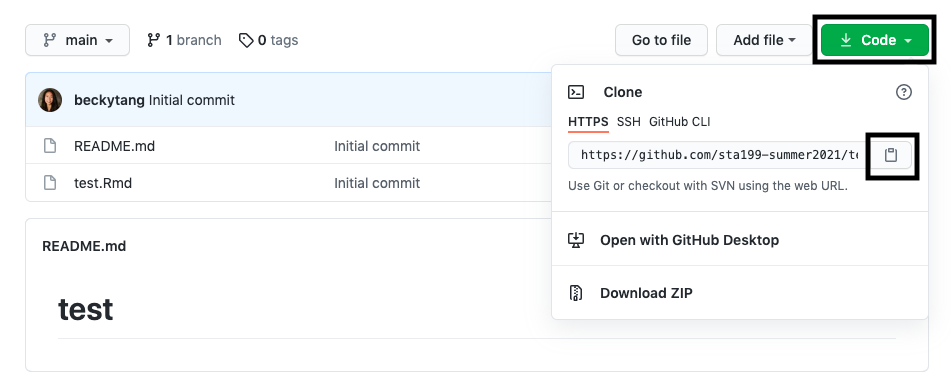

## Getting started

- Go to the course GitHub organization: https://github.com/math118-fall2022. 

- If you see a pending invite at the top of the page, accept the invite to join the course invite. We'll come back to GitHub later.

## Tour of R and RStudio 

Let's take a tour of R and RStudio. I'll do a short demo, then give you a few minutes to try out yourself. 

### Concepts introduced

- Console
- Using R as a calculator
- Environment
- Loading and viewing a data frame
- Accessing a variable in a data frame
- R functions

### Your turn!

- Go ahead and open up RStudio. 

- Use R as a calculator by typing the following in the **console**. 

```{r eval = F}
3 * 5 + 10
```

```{r eval = F}
x <- 3
x + x^2
```

```{r eval = F}
x <- 1:10
x*7
```

## Git and GitHub

### Concepts introduced:
 
- Clone a GitHub repo and make a new RStudio project 
- Configure Git
- Working with a local and remote repository
- Making a change locally, committing, and pushing
- Making a change on GitHub and pulling

### Your turn!

#### Creating personal access token 


- Go to the course GitHub organization: https://github.com/math218-fall2022. 

- On the top-right corner with, click on the drop down arrow next to the graphic and then click on "Settings"

  - On the left-hand side, find and click on "< > Developer settings" (should be on bottom)
  
  - Click "Personal access tokens"
  
  - Click "Generate new token". Under "Expiration", choose Custom and then select date 12/31/2023. Then scroll down and click "Generate token"
  
  - You will see a green bar with text that starts as "ghp_pA....". *Copy* this token and paste it somewhere safe.


#### For first time only: Clone a GitHub repo  

- Create a new folder on your Desktop called "Math118" if you haven't already

- Go to the [course organization](https://github.com/math118-fall2022) on GitHub  and find the repo with the prefix **getting-started-**. 

- Click on the green **Clone or download** button, select **Use HTTPS** (this might already be selected by default, and if it is, you'll see the text **Clone with HTTPS** as in the image below). Click on the clipboard icon to copy the repo URL.


```{r clone-repo-link, echo = FALSE, fig.width = 5}

```

- Go to the "Terminal" tab in Rstudio

- Type the following: git clone *copied URL*  (e.g. `git clone https://github.com/...`)

  - When prompted to enter your username: type in your GitHub username
  
  - When prompted to enter you password: **paste in your personal access token**

- Your new project should now be created! Note, we only go through this workflow once to tell GitHub that it should communicate with RStudio

#### For future projects: Clone a GitHub repo and make a new RStudio project 


- Go to the [course organization](https://github.com/math118-fall2022) on GitHub  and find the repo with the prefix **appex-01-**. 

- Click on the green **Clone or download** button, select **Use HTTPS** (this might already be selected by default, and if it is, you'll see the text **Clone with HTTPS** as in the image below). Click on the clipboard icon to copy the repo URL.

```{r clone-repo-link2, echo = FALSE, fig.width = 5}

```

- Open up RStudio

- Go to *File* $\rightarrow$ *New Project* $\rightarrow$ *Version Control* $\rightarrow$ *Git*. 

```{r paste-gh-repo-url, echo = FALSE,  out.width = "80%"}
knitr::include_graphics("img/00-git/clone_git.png")
```

- Copy and paste the URL of your assignment repo into the dialog box *Repository URL*. You can leave *Project Directory Name* empty. It will default to the name of the GitHub repo. In *Create project as a subdirectory of*, hit "Browse" and find your Math218 folder.

- Click *Create Project*, and the files from your GitHub repo will be displayed the *Files* pane in RStudio. You should see the files for the Flint Water Crisis analysis in the **Files** pane. 


#### Making a change locally, committing, and pushing

- Open the RMarkdown file **appex01-flint.Rmd**. We will use that for the next part of class. 

- The `R` package that we will rely on most heavily is the `tidyverse` package. Please install it now by typing the following in your **Console**:

```{r eval = F}
install.packages("tidyverse")
```

- Put your name for the author, then knit the document. *It's important to knit the document, as this saves your progress!*

- Select/check **all** of the updated files in the Git pane, click the "Commit" button, and write the commit message "Updated author name". 

- Click to **push** your changes (you may have to enter your GitHub password).

- If you refresh your repo on GitHub, you will see the updated files with your commit message. 

#### Making a change on GitHub and pulling

- On the corresponding repository in GitHub, find the README.md file at the bottom. Edit this file by clicking on the pencil and typing your name + major + year. 

- Once you're finished editing, hit the green "Commit changes" button.

- Back in RStudio, navigate to the Git tab and **pull** the changes by hitting the down arrow. A small window should pop up with some text.

- Find and open the README.md file in the Files pane. You should see your changes here locally!


## Submitting application exercises 

For application exercises, you simply need to push your final changes to your GitHub repo! Make sure your repo is updated on GitHub. That's all you need to do to submit application exercises.


## Flint Water Crisis analysis

Follow along with the instructions in **appex01-flint.Rmd**.
