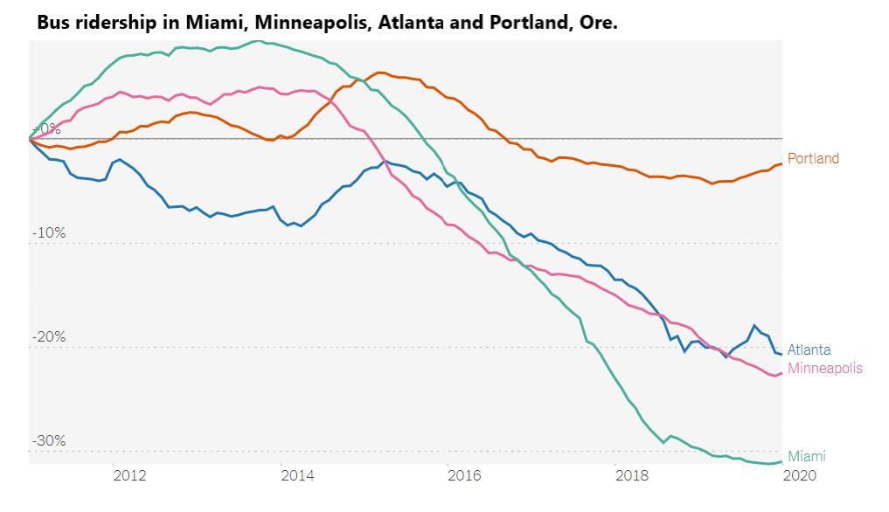
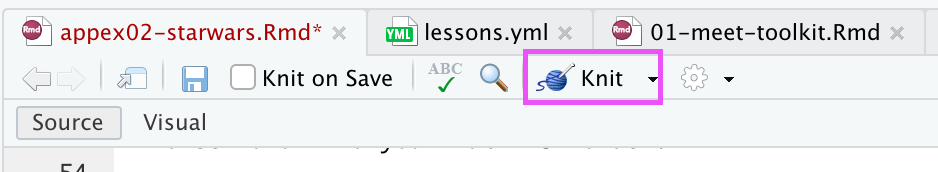

```{r load-packages, include=FALSE}
library(tidyverse)
```


## Examining data visualizations 

Discuss the following questions for each visualization:

- What is the visualization trying to show?
- What is effective, i.e. what is done well? 
- What is ineffective, i.e. what could be improved? 
- What are you curious about after looking at the visualization? 

### Figure 1

```{r echo = F, fig.align = "center", fig.cap = "Figure from the New York Times [\"What's Going on with this Graph?\"](https://www.nytimes.com/2020/04/02/learning/whats-going-on-in-this-graph-bus-ridership-in-metropolitan-areas.html) series."}

```

### Figure 2

```{r echo = F, fig.align = "center", fig.cap = "Figure originally seen on  [Twitter](https://twitter.com/reina_sabah/status/1291509085855260672)."}
knitr::include_graphics("img/female-heights.png")
```

## Clone a repo + start a new project

- Click on the link provided in the slides to create your own private repo for this exercise.

- Go to the `appex-02-[GITHUB USERNAME]` repo on GitHub that you created

- Click on the green **Code** button, **Use HTTPS**, and click on the clipboard icon to copy the repo URL.

- Open up RStudio

- Go to *File* $\rightarrow$ *New Project* $\rightarrow$ *Version Control* $\rightarrow$ *Git*. 

- Copy and paste the URL of your assignment repo into the dialog box *Repository URL*. You can leave *Project Directory Name* empty. It will default to the name of the GitHub repo. In *Create project as a subdirectory of*, hit "Browse" and find your Math118 folder.

- Click *Create Project*, and the files from your GitHub repo will be displayed the *Files* pane in RStudio. 


## Practice with ggplot

### Step 1

Modify the following plot to change the color of all points to `"pink"`. **Knit** the document to observe the changes by hitting the "Knit" button at the top of your markdown editor:

```{r echo = F, out.width="250", fig.align="center"}


```

```{r starwars-plot}
ggplot(data = starwars, 
       mapping = aes(x = height, y = mass, color = gender, size = birth_year)) +
  geom_point(color = "#30509C") +
  labs(title = "_____" , size = "_____", x = "_____", y = "_____")
```

### Step 2

Add labels for title, x and y axes, and size of points. Knit again. 

### Step 3

Fill in the code below to make a histogram of a numerical variable of your choice. Once you have modified the code, remove the option `eval = FALSE` from the code chunk header. Knit again to see the updates.

See the [ggplot2 reference page](https://ggplot2.tidyverse.org/reference/geom_histogram.html) for help to create histograms.

```{r starwars-hist, eval = FALSE}
ggplot(data = starwars, 
       mapping = aes(x = _____)) +
  ___________ +
  labs(title = "_____" , x = "_____", y = "_____")
```


### Step 4: Stretch goal!

1. Modify the histogram by adding `color = "blue"` inside of the `geom_XX` function. (Feel free to use a different color besides blue!) Knit to see the updated histogram. 

2. Now modify the histogram by adding `fill = "orange"` inside of the geom_XX function. (Feel free to use a different color besides orange!) Knit to see the updated histogram. 

3. What is the difference between `color` and `fill`? 

## Knit, commit, and push

1. If you made any changes since the last knit, knit again to get the final version of the AE. 

2. Check the box next to each document in the Git tab (this is called "staging" the changes).  Commit the changes you made using an simple and informative message.

2. Use the **green arrow** to push your changes to your repo on GitHub.

3. Check your repo on GitHub and see the updated files.

<hr> 

*This exercise was modified from "Starwars + Data visualization" in [Data Science in Box](https://datasciencebox.org/).*