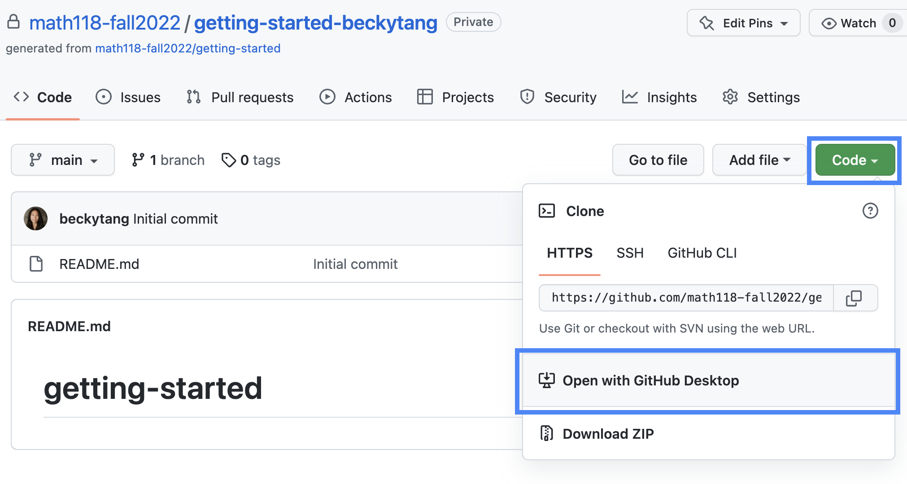
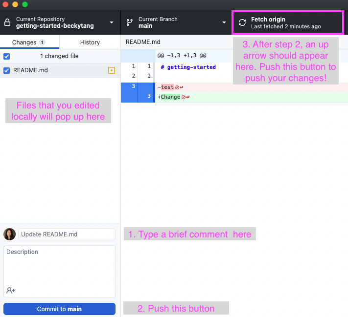

```{r load-packages, warning = FALSE, message = FALSE}
library(tidyverse)
```


## Identify variable type

- Favorite food
- Number of classes you take in a semester
- Zip code

## The way data is displayed matters

```{r echo = F, out.width = "70%", fig.align = "center", fig.cap = "Source: [Twitter](https://twitter.com/CoralTKrueger/status/1296425438403796992)"}
knitr::include_graphics("img/barplots.jpg")
```


## Clone a repo + start a new project

- Click on the link provided in the slides to create your own private repo for this exercise.

- Go to the `appex-03-[GITHUB USERNAME]` repo on GitHub that you created

```{r echo = F, fig.align="center", out.width="70%"}

```

- Click on the green **Code** button and choose **open in GitHub Desktop**. GitHub Desktop should automatically open.

```{r echo = F, fig.align="center", out.width="70%"}
knitr::include_graphics("img/00-git/find_folder.png")
```

- The GitHub Desktop application will open up, with a white window that says "Clone a Repository". **Important**: in the second line that says "Local Path", there is a button that says `Choose...`. Click on it, and find and select the Math118 folder we created for this course. Then hit the blue `Clone` button.

- After successfully cloning, the window will disappear and you will see the that Current Repository is the one you just cloned. Success!

- Navigate to the project folder you just created within the Math118 folder, and open the `appex03-airbnb.Rmd` file to begin.

## Warm-up

- Update your name in the YAML header at the top of the document. Then knit to save and compile your changes.

- Open GitHub Desktop. You should see your changed files listed here. Add a brief description such as "Added name". **Commit** your changes by hitting the blue button. Then **Push** your changes by hitting the third button at the top of the application.

```{r echo = F, fig.align="center", out.width="70%"}

```

## Practice with ggplot

The data contains information about Airbnb listings in Madrid, Spain. The data originally come from [Kaggle](https://www.kaggle.com/rusiano/madrid-airbnb-data), and it has been modified for this exercise. 

Use the code below to load the data from the .csv file. 

```{r load-data, warning = FALSE, message = FALSE}
madbnb <- read_csv("data/madbnb.csv")
```

### Part 0

The dataset you’ll be using is called `madbnb`. Run `View(madbnb)` in the **console** to view the data in the data viewer. What does each row in the dataset represent?

### Part 1

The `madbnb` data set has `r nrow(madbnb)` observations (rows).

How many columns (variables) does the dataset have? Instead of hard coding the number in your answer, use the function `ncol()` to write your answer in inline code. *Hint: Use the statement above as a guide.*

Knit to see the updates.

### Part 2

Fill in the code below to create a histogram to display the distribution of `price`.  Once you have modified the code, remove the option `eval = FALSE` from the code chunk header. Knit again to see the updates.

```{r plot-price, eval = FALSE}
ggplot(data = ___, mapping = aes(x = ___)) +
  geom_histogram()
```


### Part 3

Now let's look at the distribution of price for each neighborhood. To do so, we will make a faceted histogram where each facet represents a neighborhood and displays the distribution of price for that neighborhood.

Fill in the code below to create the faceted histogram with informative labels. Once you have modified the code, remove the option `eval = FALSE` from the code chunk header. Knit again to see the updates.

*Hint: Run `names(madbnb)` in the <b>console</b> to get a list of variable names. Note how the variable for neighborhood is spelled in the data set.*

```{r plot-price-facet, eval = FALSE}
ggplot(data = ___, mapping = aes(x = ___)) +
  geom_histogram() +
  facet_wrap(~___) +
  labs(x = "______", 
      title = "_______", 
      subtitle = "Faceted by ______")
```

### Part 4

From the plots in Part 3, you might notice that the large number of listinings in one neighborhood is obscuring our ability to see the histograms for prices in all of the other neighborhoods. Fill in the code below as you did in Part 3, but now also change the `scales` for each histogram. You can choose `scales` = "free_x", `scales` = "free_y", or `scales` = "free". Choose the option that you think best solves this issue.

Once you have modified the code, remove the option `eval = FALSE` from the code chunk header. Knit again to see the updates.

```{r plot-price-facet_scales, eval = FALSE}
ggplot(data = ___, mapping = aes(x = ___)) +
  geom_histogram() +
  facet_wrap(~___, scales = "_____") +
  labs(x = "______", 
      title = "_______", 
      subtitle = "Faceted by ______")
```

### Part 5

How would you describe the distribution of price in general? How do neighborhoods compare to each other in terms of price?

## Knit, commit, and push

1. If you made any changes since the last knit, knit again to get the final version of the AE. 

2. Go to the GitHub Desktop application. You should see all the changed and new files listed.

2. Add a brief message, then **commit** your changes, and **push** them to your repo on GitHub.

3. Check your repo on GitHub and see the updated files.

## Resources 

- [ggplot2 reference page](https://ggplot2.tidyverse.org/reference/geom_histogram.html) 
- [ggplot2 cheat sheet](https://rstudio.com/wp-content/uploads/2015/03/ggplot2-cheatsheet.pdf)


<br><br>

<hr> 

*This exercise was modified from Hotels in Edinburgh in [Data Science in Box](https://datasciencebox.org/).*
