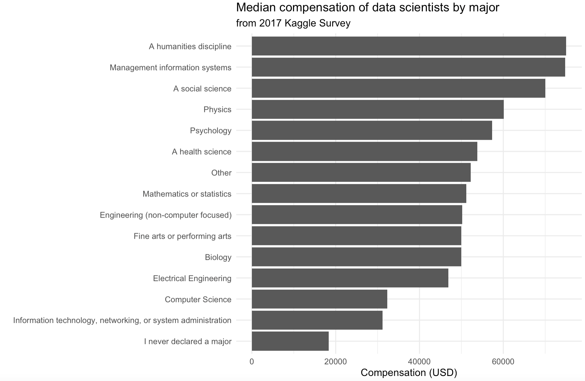

## Code styling + workflow 

- Avoid long lines of code. 
  - We should be able to see <u>all</u> of your code.
- Name code chunks.
- Knit, commit, and push regularly. 
  - Think about it like clicking to save regularly as you type a report.


## Questions? 


## Clone a repo + start a new project

Go to the `appex-06-[GITHUB USERNAME]` repo, clone it into your Math118 folder, and start a new project in RStudio. 

## Note

For this Application Exercise, you are provided with lots of starter code/hints. In order to allow the whole document to run, we have set each `R` chunk headers to `eval = FALSE`. As you complete each exercise, change the `R` chunk header to `eval = TRUE` before you knit in order to run your changes.


## Practice with data joins and wrangling


You may need to install the `scales` library. If so, run `install.packages("scales")` in your **console**.

```{r setup, eval  = F}
library(tidyverse)
library(scales)
# From Kaggle: https://www.kaggle.com/datasets/kaggle/kaggle-survey-2017/221
datascience <- read_csv("data/kaggle_survey_subset.csv", show_col_types = F) 
conversion <- read_csv("data/kaggle_conversionRates.csv", show_col_types = F) 
```

We will continue working with the Kaggle survey data about data science. You may recall that each respondent provided their compensation amount in their home currency. This application exercise will join data sets in order to convert the currency to USD. Take a look at the `conversion` data by typing `View(conversion)` in your Console.

### Exercise 1

We wish to add to the `datascience` data the conversion rate from the original `CompensationCurrency` to the USD.  

Write code that joins together the `datascience` dataset and the `conversion` dataset by the variable they have in common. Store it by saving over the current `datascience` data frame. The code below will help you get started. 

```{r join, eval = FALSE}
<- datascience %>%
  left_join(______, by = ______)  
```


### Exercise 2

Now create a new variable called `compensationUSD` that converts the original `CompensationAmount` into USD. This is achieved by multiplying the `CompensationAmount` by the `exchangeRate`. Store it by saving over the current `datascience` data frame.

```{r eval = F}
<- datascience %>%
  __________

```

### Exercise 3


Create a new data frame called `compensation_summary` that calculates 
median compensation in USD for each `Major`. 

Recall that the function for calculating the median is `median()` in R.

```{r compensation-summary-major, eval=FALSE}
# code here                      
```

### Exercise 4

Take the `compensation_summary` data frame and order the results in descending 
order of median USD compensation. Is anything surprising?

```{r compensation-summary-major-sorted}
# code here
```

### Exercise 5

Recreate the following graph using the `compensation_summary` data frame you created! The code should help you get started, just fill in the necessary information!

```{r echo = F, fig.align="center", fig.width=6, fig.height=4}

```

```{r plot-compensation-summary, eval = F, echo = FALSE}
ggplot(compensation_summary, 
       aes(y = fct_reorder(Major, med_comp), x = med_comp)) +
  geom_col() +
  labs(
    x = "Compensation (USD)",
    y = "",
    title = "Median compensation of data scientists by major",
    subtitle = "from 2017 Kaggle Survey",
  ) +
  theme_minimal()
```

```{r plot-compensation-summary-start, eval = FALSE}
ggplot(data = ________, 
       aes(y = fct_reorder(______, _______), x = _______)) +
  geom_col() +
  labs(
    x = "Compensation (USD)",
    y = "",
    title = "Median compensation of data scientists by major",
    subtitle = "from 2017 Kaggle Survey",
  ) +
  theme_minimal()
```

### Submit

Once you're finished, knit, commmit, and then push to GitHub!