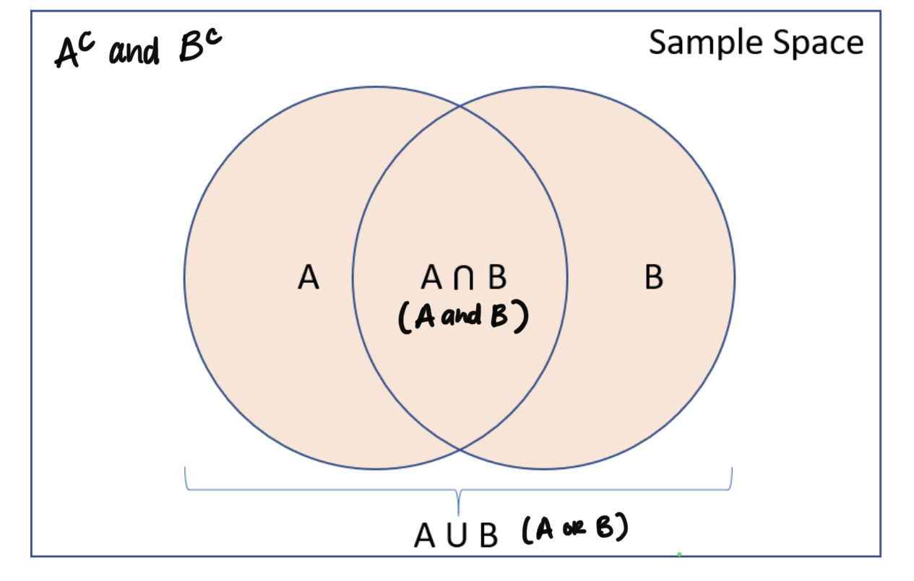

```{r include = F}
library(tidyverse)
library(MASS)

```


## Using a Venn Diagram

```{r echo = F, fig.align = "center"}

```


## Clone a repo + start a new project

Go to the `ae-07-[GITHUB USERNAME]` repo, clone it, and start a new project in RStudio. 

## Data

We will be working with some data on **205 patients** in Denmark with malignant melanoma (skin cancer). While the dataset `Melanoma` is provided through the package `MASS`, I have wrangled the data slightly to make it easier to understand for our purposes. We will work the wrangled data frame. 

```{r wrangle}
data("Melanoma")
Melanoma <- Melanoma %>%
  mutate(ulcer = ifelse(ulcer == 1, "Present", "Absent"),
         sex = ifelse(sex == 1, "Male", "Female"),
         status = case_when(status == 1 ~"Died (melanoma)",
                            status == 2 ~ "Alive",
                            T ~ "Died (other cause)"))
```

The following tables are representative of the data. You may knit the document to see the tables, or refer to the Application Exercise description on our course website. 

```{r melanoma-data, echo = F}
knitr::kable(table(Melanoma$status, Melanoma$sex),
             caption = "Sex demographics")

knitr::kable(table(Melanoma$status, Melanoma$ulcer),
             caption = "Ulcer distribution")
```

Answer the following questions using the data and tables provided above (knit this
document first to see the tables!). If a probability cannot be calculated, indicate what additional information is needed in order to do so.

## Exercise 1

What is the probability that a randomly selected patient in the study was 
assigned to died due to melanoma? Answer this question two ways: using the data frame and tidyverse code, and using the table.

```{r ex-1-tidyverse}

```

```{r ex-1-table}

```

## Exercise 2

What is the probability that a randomly selected patient had an ulcer?

```{r ex-2}

```

## Exercise 3

What is the probability that a randomly selected patient in the trial 
died due to melanoma **and** had an ulcer? 

```{r ex-3}

```

## Exercise 4

What is the probability that a randomly selected patient in the trial 
died due to melanoma **or** had an ulcer?


```{r ex-4}

```


## Exercise 5

What is the probability that a randomly selected patient in the trial 
is alive **and** had an ulcer **and** is female?

```{r ex-5}

```

## Submission

Once you are finished, submit this application exercise by knitting, committing, and pushing to GitHub!
  