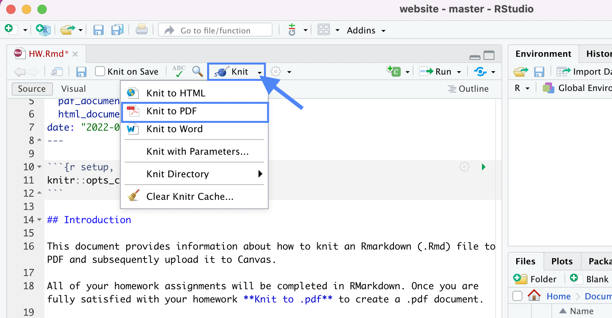
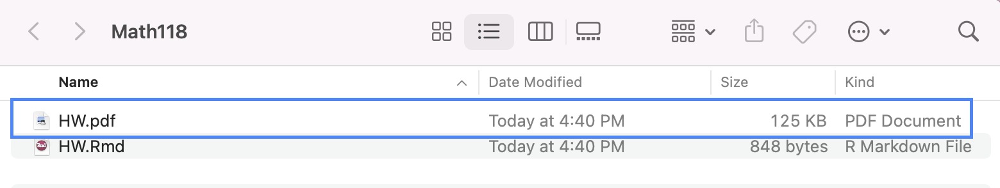

```{r setup, include=FALSE}
knitr::opts_chunk$set(echo = F, fig.align = "center")
```

## Introduction

This document provides information about Rstudio, how to knit an Rmarkdown (.Rmd) file to PDF and subsequently upload it to Canvas.

### RStudio & R Markdown

Below are the general components of an RStudio project. 

```{r echo=FALSE, fig.fullwidth = TRUE, out.width = "90%"}
knitr::include_graphics("img/01-hello-r/rstudio-anatomy.png")
```

Below are the general components of an RMarkdown file. 

```{r echo=FALSE, fig.fullwidth = TRUE, out.width = "90%"}
knitr::include_graphics("img/01-hello-r/rmarkdown.jpg")
```

To get more details about the RStudio project, RMarkdown file, and just R in general, read [Getting Started](https://socviz.co/gettingstarted.html#gettingstarted) in *Data Visualization* by Kieran Healy.

### Knitting to PDF

All of your homework assignments will be completed in RMarkdown as .Rmd files. It is good practice to periodically **Knit to PDF** to create a .pdf document, as the final version will be submitted as a PDF document.

```{r}

```

A PDF version of your assignment should generate. You may get a pop-up window asking if it's okay to open it. If so, "accept". 

### Upload to Canvas

Once you are fully satisfied with your homework and are ready to submit, knit to PDF once more. Navigate to your Math118 folder on your Desktop.

```{r}

```

Then find the .pdf file associated with the assignment.

```{r}

```

Upload this PDF file to the corresponding Assignment on Canvas.


