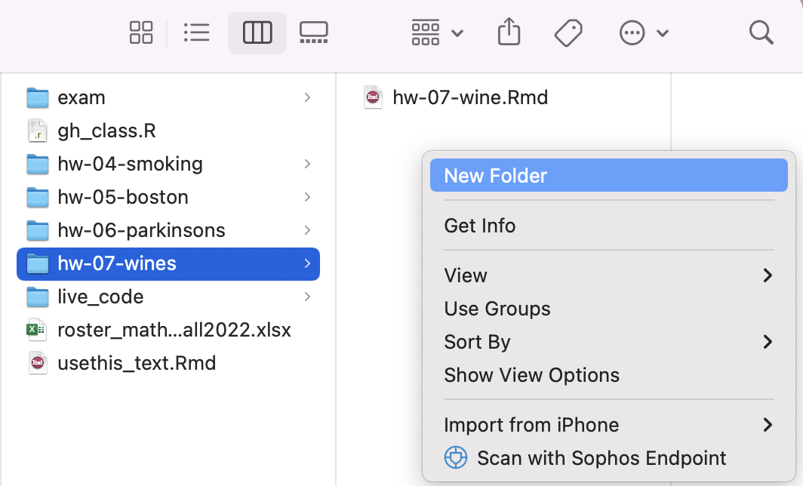
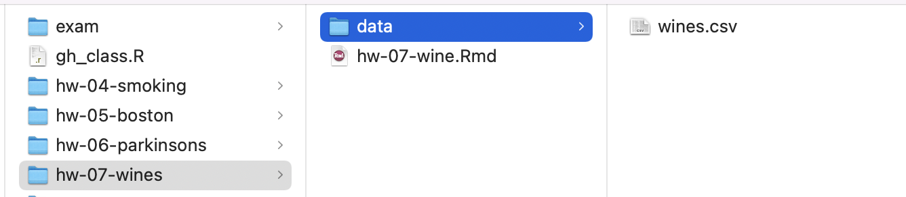

```{r include=FALSE}
library(tidyverse)
library(tufte)
library(knitr)
options(
  htmltools.dir.version = FALSE, # for blogdown
  show.signif.stars = FALSE,     # for regression output
  digits = 2
  )
```


# What makes a good wine?

The goal of this homework is to continue practicing two-sample statistical inference using
both simulation-based approaches. Use the lecture notes, readings, 
and application exercises to help you complete homework.

# The Data

Today's dataset has been adapted from a large data set of wine reviews from
[Kaggle](https://www.kaggle.com/zynicide/wine-reviews). Reviews were scraped from 
WineEnthusiast, which contain information about both the wine itself as well as 
the reviewer's description of that wine. Here, I provide a subset of the data. 
You may consider each of these observations to be an
independent, representative sample of all wines.

The variables are as follows

- `country`: the country that the wine is from (France, Italy, US)
- `points`: the number of points WineEnthusiast rated the wine on a scale of 1-100. 
- `price`: cost for a bottle (USD)
- `variety`: type of grapes used to make the wine
- `type`: red or white wine
- `title`: title of the wine review
- `description`: reviewer's description of the wine

Write all R code according to the 
style guidelines discussed in class. 


To following resource provides code needed to make useful symbols. You may use
the code to typeset the characters of interest in the *narrative* of your
document:

- $\mu$: `$\mu$`
- $\alpha$: `$\alpha$`
- $>$: `$>$`
- $<$: `$<$`
- $\neq$: `$\neq$`
- $H_0$: `$H_{0}$`
- $H_a$: `$H_{a}$`
- $p_{group}$: `$p_{group}$`


# Exercises

**Overall hint:** When performing a hypothesis test, you must provide the 
significance level of your test, the null and alternative hypotheses, the 
p-value, your decision, and an interpretation of the p-value in context of the 
original research question. 

**At the start of each exercise that requires simulation, set a random seed equal to the exercise number in the R chunk.**

**Make sure that your code is reproducible.**

## Part 0

The data are not pre-provided for you this week! Instead, you will add it to your GitHub `hw-07-wine` project yourself!

- Go to Canvas $\Rightarrow$ Files and download the file called `wines.csv`. Locate this file on your local computer, usually found in your `Downloads` folder.

```{r data-folder, fig.margin = TRUE, echo = FALSE, eval=TRUE, fig.width=5}

```

- From your `Math 118` folder you created for this course, find the `hw-07-wine` project folder corresponding to this homework. Now create a new `data/` folder *within* this folder.


- Within your new `data/` folder, upload the `wines.csv` file.  

```{r data-upload, fig.margin = F, echo = FALSE, eval=TRUE, fig.width=3}

```

You may now load in the data with the following code as per usual, where `____` should be
replaced by a meaningful name of your choosing. Then remove `eval = FALSE` before you knit!


```{r eval=FALSE}
library(tidyverse)
library(infer)
____ <- read.csv("data/wines.csv")
```


## Part 1

1. For this exercise alone, consider wines from the US and Italy only. Evaluate the hypothesis
that the `country` where the wine is produced is independent of its `type` (red or white).
Use a significance level of  $\alpha = 0.05$. Visualize your null distribution.

```{marginfigure}
```

## Part 2

Let's say I'm doing to a nice dinner party, and I'm told to bring a bottle of wine.  I want to bring an acceptable bottle, but I don't like these friends enough to spend more 
than $20 on a bottle of wine. So I have to be strategic. I've been told that a cheap white is usually better than a cheap red, but that an expensive red is always better than an expensive white. Maybe I should buy a wine based on its points-to-price ratio. 

2. Wrangle your data frame to create a new variable `ratio`, calculated as a wine's points divided by its price.

```{marginfigure}
```

3. Wines with higher values for this ratio might indicate that the wine is a good deal. Comprehensively evaluate the hypothesis at the $\alpha = 0.05$ level that among wines that are at most $20 per bottle, 
white wines have a higher average point-to-price ratio compared to red wines. You **do not** need to visualize the null distribution.

```{marginfigure}
```

4. How would your decision and conclusion change if we used $\alpha = 0.10$ instead?


```{marginfigure}
**Hint**: refer back to the lectures about probability and the definition of Type I error
to answer this question! 
```

5. Suppose you perform 10 independent hypothesis tests at the $\alpha = 0.05$
level, and further suppose that in reality, the null hypothesis is TRUE for all
10 tests. What is the probability that you make at least one Type I error?

```{marginfigure}
```

6. Let's say you just really hate white wine and are trying to demonstrate to others that it's associated with lower ratings in terms of points. Describe the potential ethical ramifications of performing all of these tests and reporting only the significant results from the tests that support your narrative. 
Consider your answer from Exercise 5 in crafting this narrative.

```{marginfigure}
```


# Submission

Knit to PDF to create a PDF document. Knit and commit all remaining changes, 
and push your work to GitHub. Make sure all files are updated on your GitHub 
repo.

Please upload your PDF document to Canvas.


