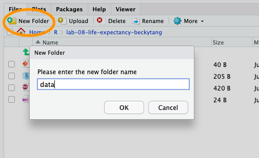

```{r include=FALSE}
library(tidyverse)
library(tufte)
library(knitr)
options(
  htmltools.dir.version = FALSE, # for blogdown
  show.signif.stars = FALSE,     # for regression output
  digits = 2
  )
knitr::opts_chunk$set(eval = FALSE)
```

## Introduction

Life expectancy is a key metric for assessing population health, as it takes into account both infant and elderly mortality. It can be used to compare countries, with the generally accepted belief that a higher life expectancy is associated with a higher quality of life. However, the inequality of life expectancy is still very large across and within countries. We will be examining data about life expectancy across countries. In particular, 
you will analyze data from the World Health Organization using linear regression models in order to learn what factors are important for determining a country's average life expectancy in a given year. 

The data were modified from this [Kaggle](https://www.kaggle.com/kumarajarshi/life-expectancy-who) dataset. According to the website, "the Global Health Observatory (GHO) data repository under World Health Organization (WHO) keeps track of the health status as well as many other related factors for all countries. The datasets are made available to public for the purpose of health data analysis. The dataset related to life expectancy, health factors for 193 countries has been collected from the same WHO data repository website and its corresponding economic data was collected from United Nation website. Among all categories of health-related factors only those critical factors were chosen which are more representative." However, due to missing data for certain countries, they ultimately decided to remove ten countries from the final dataset. Thus the resultant dataset contains information about 183 countries. 


# Packages

In this lab we will work with the `tidyverse` and `broom` packages.

```{marginfigure}
The broom package is installed with the tidyverse, but we need to load it separately in order to make use of it.
```

```{r eval = F}
library(tidyverse) 
library(broom)
```

# The data

In this homework you will upload the data yourself!

- Go to Canvas $\Rightarrow$ Files and click on the file called `life_expectancy.csv`. This should 
automatically download the data file. Locate this file on your local computer, usually found in your `Downloads` folder.

- Create a `data/` folder in your RStudio project folder corresponding to this homework.

```{r data-folder, fig.margin = TRUE, echo = FALSE, eval=TRUE, fig.width=3}

```

- Navigate to the `data/` folder and upload the `life_expectancy.csv` file.

```{r data-upload, fig.margin = TRUE, echo = FALSE, eval=TRUE, fig.width=3}
knitr::include_graphics("img/08-life-expectancy/data-upload.png")
```

Then, you can load the data as usual using the following.

```{r data, eval=F}
life_expect <- read_csv("data/life_expectancy.csv")
```

## Codebook

| Variable name    | Description 
|:--------|:-------------------------------
| `country` 		     | Country
| `year` 		       | Year (2000-2015)
| `status` 	   | Developed or Developing country status
| `life_expectancy` 		       | life expentancy in age
| `adult_mortality` 	     | Adult Mortality Rates of both sexes (probability of dying between 15 and 60 years per 1000 population)
| `infant_deaths` 		       | Number of Infant Deaths per 1000 population
| `alcohol`  | Alcohol, recorded per capita (15+) consumption (in litres of pure alcohol)
| `percentage_expenditure`   | Expenditure on health as a percentage of Gross Domestic Product per capita (%)
| `hepB`   | Hepatitis B immunization coverage among 1-year-olds (%)
| `measles` 	   | Number of reported cases of Measles per 1000 population
| `BMI` 	   | Average Body Mass Index (BMI) of entire population
| `under_five_deaths`    | Number of under-five deaths per 1000 population
| `polio`    | Polio immunization coverage among 1-year-olds (%)
| `total expenditure`    | General government expenditure on health as a percentage of total government expenditure (%)
| `diphtheria`    | Diphtheria tetanus toxoid and pertussis immunization coverage among 1-year-olds (%)
| `HIV_AIDS`    | Deaths per 1000 live births HIV/AIDS (0-4 years)
| `GDP`    | Gross Domestic Product per capita (in USD)
| `population`    | Population of the country
| `thinness_10_19`    | Prevalence of thinness among children and adolescents for Age 10 to 19 (% )
| `thinness_5_9`    | Prevalence of thinness among children for Age 5 to 9(%)
| `income_composition`    | Human Development Index in terms of income composition of resources (index ranging from 0 to 1)
| `schooling`    | Number of years of schooling


To following resource provides code needed to make useful symbols. You may use
the code to typeset the characters of interest in the *narrative* of your
document:

- $\hat{y}$: `$\hat{y}$`
- $\widehat{response}$: `$\widehat{response}$`
- $y_{unit}$: `$y_{unit}$`


# Exercises

## Part 1: Data Manipulation 

1.  While the data provided spans from 2000-2015, we will be focusing on a single year of data. Filter the data to only retain observations from 2015. Additionally, create the following new variable:

- `BMI_cat`: the category that each BMI falls into, where BMI < 18.5 is "underweight", 
18.5 $\leq$ BMI $<$ 25 is "normal", 25 $\leq$ BMI $<$ 30 is "overweight", and BMI $\geq 30$ is "obese".


## Part 2: Exploratory Data Analysis

2.  Visualize the distribution of `life_expectancy`. Is the distribution skewed? What does 
    that tell you about the average life expectancy across countries? Is this what you expected to 
    see? Why, or why not? Include any summary statistics and visualizations
    you use in your response.

```{marginfigure}
```

3.  Visualize and describe the relationship between `life_expectancy` and `schooling`. 
    
```{marginfigure}
```

## Part 3: Simple linear regression with a numerical predictor

```{marginfigure}
Linear model is in the form $\hat{y} = b_0 + b_1 x$.
```

4.  Let's see if the apparent trend in the plot is something more than
    natural variation. Fit a linear model called `m_school` to predict average
    `life expectancy` by average number of years of schooling (`schooling`). Based on the 
    regression output, write the linear model.

```{marginfigure}
```

5.  Replot your visualization from Exercise 3, and add the regression line to this plot
    in orange color. Turn off the shading for the uncertainty of the line.

```{marginfigure}
```

6.  Interpret the slope of the linear model in context of the data.

```{marginfigure}
```

7.  Interpret the intercept of the linear model in context of the data. Comment on whether 
    or not the intercept makes sense in this context.

```{marginfigure}
```


## Part 4: Linear regression with a categorical predictor

8.  Fit a new linear model called `m_status` to predict the  `life expectancy` of  
a country based on its `status`. Based on the regression output, write the linear 
    model and interpret the slope and intercept in context of the data.

```{marginfigure}
```

9. What is the equation of the line corresponding to developed countries? What is it for 
    developing countries?
  
```{marginfigure}
```

10. Fit a new linear model called `m_bmi` to predict average `life_expectancy` 
    based on the `BMI_cat` of the country. Based on the regression output, write the linear 
    model and interpret the slopes and intercept in context of the data.
    

```{marginfigure}
The function `fct_relevel()` allows you to change the order of levels of a categorical variable. 
The syntax is `fct_relevel(<name of variable>, <"baseline level">)`
```

11. Create a new variable called `BMI_relevel` where `"underweight"` is the baseline level. You have some starter code here. 

```{r ex11, eval = F}
life_expect <- life_expect %>%
  mutate(_____ = fct_relevel(, ))

```

12. Fit a new linear model called `m_bmi_relevel` to predict average
    `life_expectancy` based on `bmi_relevel` of the country. This is the new (releveled) variable 
    you created in Exercise 11. Based on the regression output, write the linear 
    model and interpret the intercept and one slope of your choice in  the context of the data. 
    
# Submission

**Before you wrap up the assignment, make sure all documents are updated on your GitHub repo. we will be checking these to make sure you have been practicing how to commit and push changes.**

Once your work is finalized in your GitHub repo, submit the final PDF it to Canvas.


    

