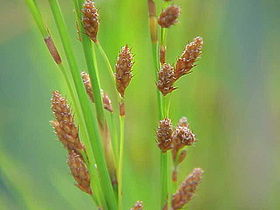
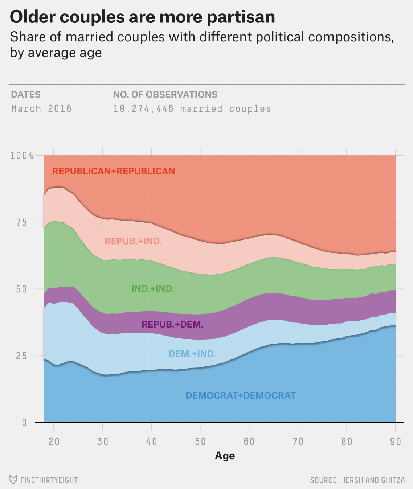
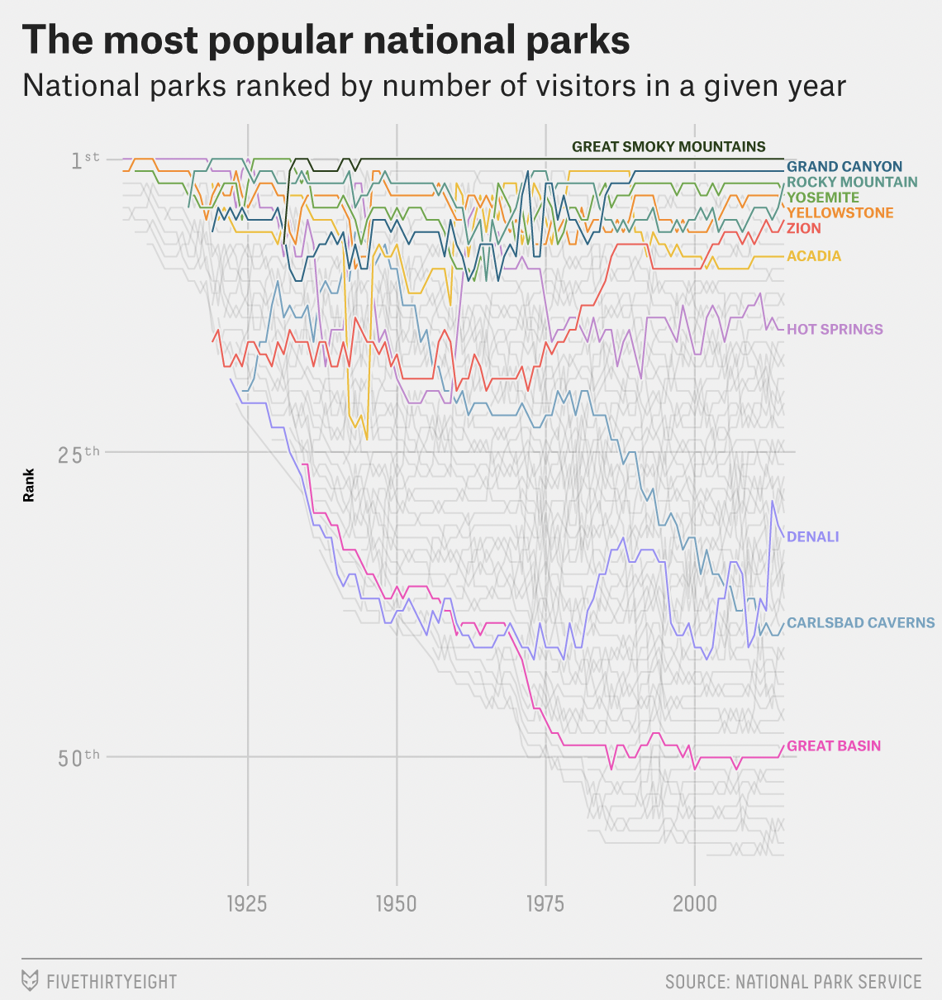
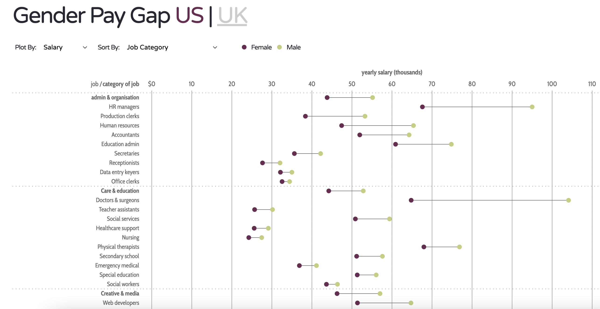
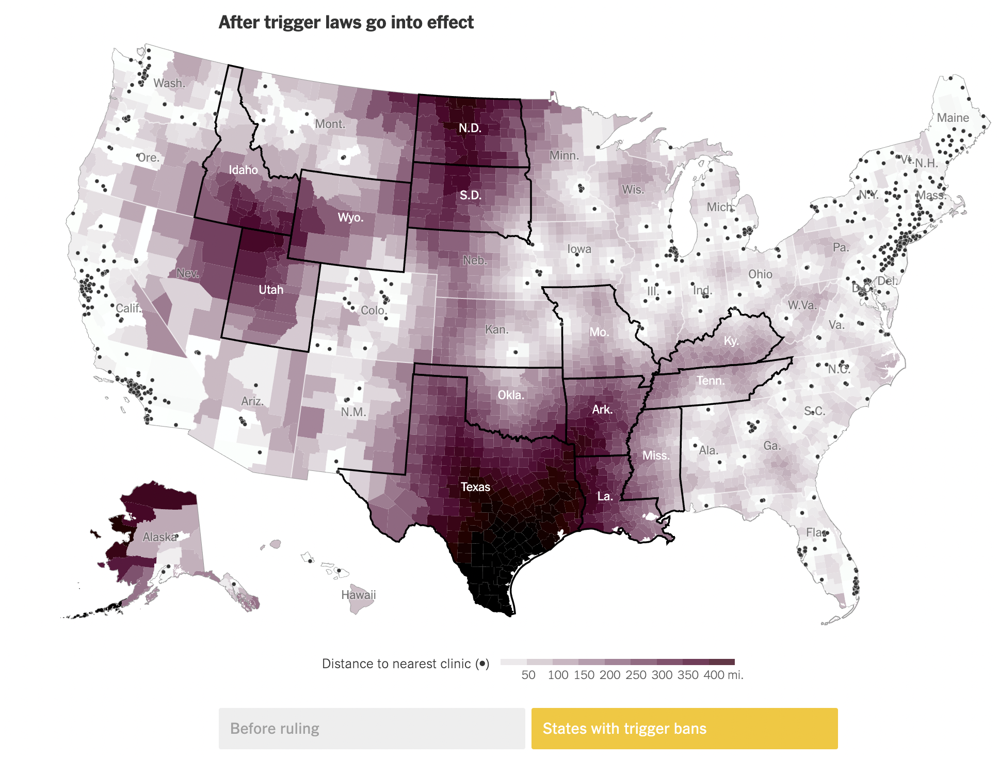
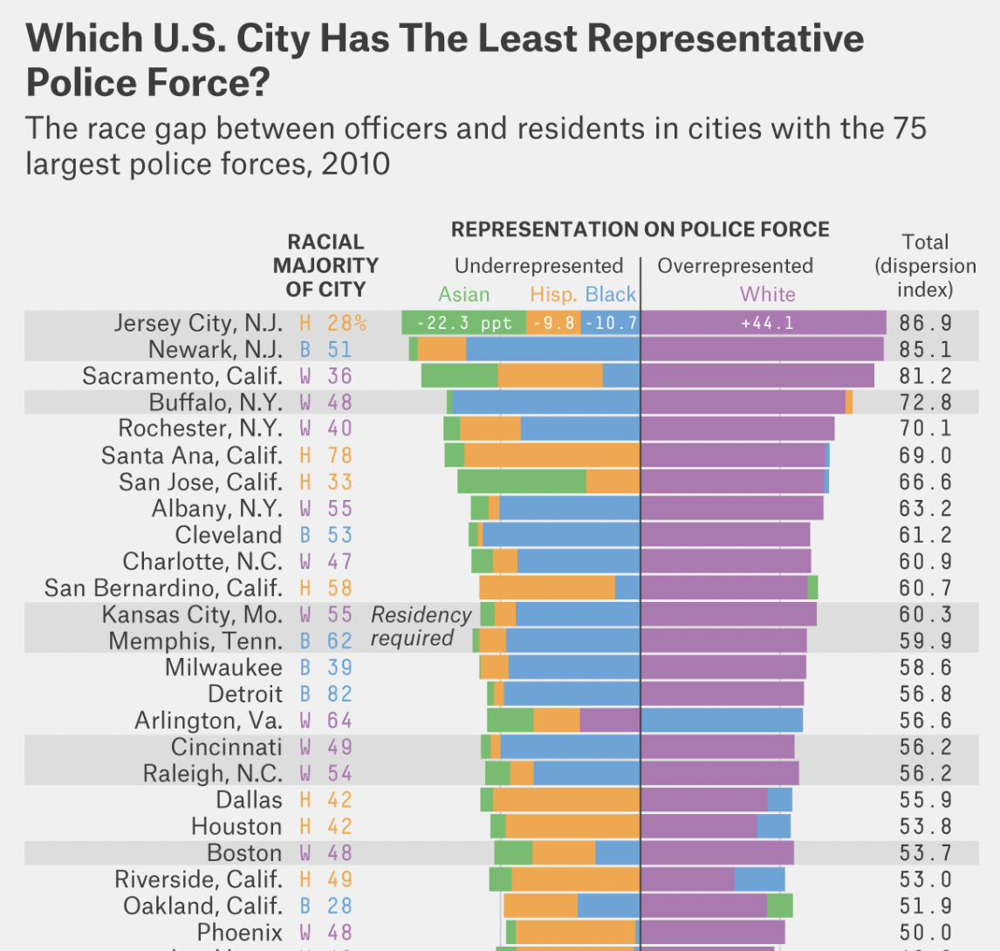

```{r setup, include=FALSE}
# R options
options(
  htmltools.dir.version = FALSE, # for blogdown
  show.signif.stars = FALSE,     # for regression output
  warm = 1
  )
# Set dpi and height for images
library(knitr)
opts_chunk$set(fig.height = 2.65, dpi = 300) 
# ggplot2 color palette with gray
color_palette <- list(gray = "#999999", 
                      salmon = "#E69F00", 
                      lightblue = "#56B4E9", 
                      green = "#009E73", 
                      yellow = "#F0E442", 
                      darkblue = "#0072B2", 
                      red = "#D55E00", 
                      purple = "#CC79A7")

options(htmltools.dir.version = FALSE)
knitr::opts_chunk$set(
	fig.align = "center",
	fig.height = 3.75,
	fig.width = 6.25,
	message = FALSE,
	warning = FALSE
)
```

```{r echo=FALSE, message=FALSE, warning=FALSE}
library(tidyverse)
library(rvest)
```

class: center, middle

# Welcome!

---

## What is Data Science?

*"Data science is a concept to unify statistics, data analysis, machine learning and their related methods in order to understand and analyze actual phenomena with data. It employs techniques and theories drawn from many fields within the context of <font class="vocab">mathematics, statistics, information science, and computer science</font>."*

.pull-right[
[-Wikipedia](https://en.wikipedia.org/wiki/Data_science)
]

We will be leveraging the programming language R to introduce ourselves to data science.
---


## Necessary background

We assume ZERO background in data science, statistics, and coding. We will help you get started with learning statistics, but this course will *not* be your typical intro stats course.

There is a large emphasis on computing, so all we need is an openness to learn! (and a laptop)

That being said, there is a lot of material in this course! 

---

class: regular

## Instructor

[Becky Tang](https://beckytang.rbind.io/)

<i class="material-icons">mail_outline</i> &nbsp;[btang@middlebury.edu](mailto:btang@midlebury.edu)<br>
<i class="material-icons">calendar_today</i>&nbsp; M 3-5pm, F 10:30am-12:00pm (and by appointment)

--

.pull-left[
```{r, echo=FALSE,out.width = '100%'} 
knitr::include_graphics("img/00/eBird.png")
```
]

--

.pull-right[
```{r, echo=FALSE,out.width = '100%'} 

```
]
---


## Where to find information

- Course website: [https://math118-fall2022.github.io/website/](https://math118-fall2022.github.io/website/)

- GitHub (assignments): [https://github.com/math118-fall2022](https://github.com/math118-fall2022)


---

## Course Objectives

- Learn to explore, visualize, and analyze data in a reproducible and shareable manner

- Gain experience in data wrangling and munging, exploratory data analysis, predictive modeling, and data visualization

- Work on problems and case studies inspired by and based on real-world questions and data

- Learn to effectively communicate results through written assignments and final project presentation

---

class: middle, center

## Examples of Data Science


---

## Partisanship and marriage age

```{r, echo=FALSE,out.width= '50%'} 

```

[Source: 538](https://fivethirtyeight.com/features/how-many-republicans-marry-democrats/)

---

## National parks 

```{r, echo=FALSE,out.width = '60%'} 

```


[Source: 538](https://fivethirtyeight.com/features/the-national-parks-have-never-been-more-popular/)

---

## Gender pay gap

```{r, echo=FALSE,out.width = '100%'} 

```

[Source: InformationIsBeautiful](https://informationisbeautiful.net/visualizations/gender-pay-gap/)

---

## Abortion maps

```{r, echo=FALSE,out.width = '80%'} 

```


[Source: NYT](https://www.nytimes.com/interactive/2022/06/24/upshot/dobbs-roe-abortion-driving-distances.html?searchResultPosition=17)

---

## Police representation

```{r, echo=FALSE,out.width = '65%'} 

```


[Source: 538](https://fivethirtyeight.com/features/reexamining-residency-requirements-for-police-officers/)

---

## TED Talk
[https://www.youtube.com/watch?v=hVimVzgtD6w](https://www.youtube.com/watch?v=hVimVzgtD6w)

---

class: center, middle

## Your Turn!

---

## Create a GitHub account

<small>

<small>

.instructions[
Go to https://github.com/, and create an account (unless you already have one). After you create your account, click [here](https://forms.gle/CzeyScmzudMTbMTQ6) and enter your GitHub username.
]

Tips for creating a username from [Happy Git with R](http://happygitwithr.com/github-acct.html#username-advice).

- Incorporate your actual name!
- Reuse a username from other contexts if you can, e.g., Twitter or Slack.
- Pick a username you will be comfortable revealing to your future boss.
- Shorter is better than longer.
- Be as unique as possible in as few characters as possible.
- Make it timeless.
- Avoid words laden with special meaning in programming, like `NA`.

</small>

.instructions[
Raise your hand if you have any questions.
]

---

## Time for an analysis!

- Let's take a look at the [UN Votes](https://math118-fall2022.github.io/website/appex/00-unvotes.html) analysis


---

## Discussion 

Share with the class!

1. Start by introducing yourself! Name, year, major/ academic interest, favorite hobby.

2. Consider the plot in Part 1. Describe how the voting behaviors of the five countries have changed over time.

3. Consider the plot in Part 2. 
    - On which issues have the three countries voted most similarly in recent years?  
    - On which issues have they voted most differently in recent years? 
    - Has this changed over time?

---

class: middle, center

## Course Policies

---

## Class Meetings 

--

<font class="vocab">Lecture</font> 
- Focus on concepts behind data analysis
- Interactive lecture that includes examples and hands-on exercises
- Bring fully-charged laptop to every lecture
    - Please let me know as soon as possible if you do not have access to a laptop

---

## Textbooks

None are required, but here are some supplemental resources:

- [OpenIntro Statistics, 4th Edition](https://www.openintro.org/stat/textbook.php?stat_book=os)
    - Free PDF available online. Hard copy available for purchase.
    - Assigned readings about statistical content
  
- [R for Data Science](http://r4ds.had.co.nz/)
    - Free online version. Hard copy available for purchase.
    - Assigned readings and resource for R coding using `tidyverse` syntax.

---

## Activities & Assessments

- <font class="vocab">Homework</font>: Weekly individual homework assignments combining conceptual and computational skills. Usually assigned Wednesdays after class, and due the following Tuesday on Canvas at 11:59pm. *Lowest score will be dropped.*

--

- <font class="vocab">Application Exercises</font>: Exercises usually started in class and when assigned, due at 11:59pm before the next class. Graded based on a good-faith effort has been made in attempting all parts. Successful on-time completion of at least 90% will result in full points for that AE; anything lower than that will be assigned points accordingly. *Lowest two scores will be dropped.*

--

- <font class="vocab">Data Visualization Examples</font>: Sign up to briefly present (~2 min) a visualization that you find interesting and meaningful. Around two presentations per week. This will include a small written component as well.


---

## Activities & Assessments (cont.)


- <font class="vocab">Exams</font>: One take-home midterm exam, scheduled for **Monday, Oct. 17, 2022**.

--

- <font class="vocab">Final Project</font>: Projects presented during the last two days of the semester on **Friday Dec. 9, 2022 and Monday, Dec. 12, 2022**. You must complete the project and present in class to pass the course.

--

- <font class="vocab">Participation</font>: I expect you to attend every class! Additionally, there will be various small assignments to help deepen your learning experience (e.g. reflection exercises, peer feedback)

---

## Grade Calculation

<small>

| Component | Weight |
|---------------|--------|
| Homework | 30%|
| Application Exercises | 15% |
| Midterm Exam | 20% |
| Final Project | 25% |
| Sharing visualization | 5% |
| Participation | 5% |

--


- You are expected to attend all lectures. Excessive absences can impact your final course grade.


</small>

---

## Excused Absences

- Students who miss a class due to a scheduled varsity trip, religious holiday, or short-term illness should fill out the respective form.
     - These excused absences do not excuse you from assigned work. 
--
- If you have a personal or family emergency or chronic health condition that affects your ability to participate in class, please contact your academic dean’s office.
--

- Exam dates cannot be changed and no make-up exams will be given. 

---

## Late Work &amp; Regrade Requests

- Homework assignments: 
    - After the assigned deadline, there is a 10% penalty for each day the assignment is late
    - Please communicate with me early if you will need a homework extension!
    
- Late work will only be accepted for homework assignments. 

- Regrade requests must be submitted within one week of when the assignment is returned 

---

## Academic Honesty

All work for this class should be done in accordance with the Middlebury Honor code.

Any violations will automatically result in a grade of 0 on the assignment and will be reported to [Office of Student Conduct](https://studentaffairs.duke.edu/conduct) for further action.

---

## Reusing Code

- Unless explicitly stated otherwise, you may make use of online resources (e.g. StackOverflow) for coding examples on assignments. If you directly use code from an outside source (or use it as inspiration), you must or explicitly cite where you obtained the code. Any recycled code that is discovered and is not explicitly cited will be treated as plagiarism.

- On individual assignments, you may discuss the assignment with one another; however, you may not directly share code or write up with other students. 

- On team assignments, you may not directly share code or write up with another team. Unauthorized sharing of the code or write up will be considered a violation for all students involved. 

---

## Where to find help

- **If you have a question during lecture, feel free to ask it!** There are likely other students with the same question, so by asking you will create a learning opportunity for everyone.

--

- **Office Hours**: A lot of questions are most effectively answered in-person, so office hours are a valuable resource. Please use them! If my scheduled office hours do not work for you, feel free to send me an e-mail!

--

 **Around you**: I encourage you to work with each other on homework! However, unless the assignment is explicitly stated to be a group assignment, your submitted work must be your own.

--

- **Campuswire**: An online forum for asking and answering questions. Great place to post general/clarifying questions about lecture material or assignments.

---


### Inclusion 

In this course, we will strive to create a learning environment that is welcoming to all students. If there is any aspect of the class that is not welcoming or accessible to you, please let me know immediately. 
<br><br> 

Additionally, if you are experiencing something outside of class that is affecting your performance in the course, please feel free to talk with me and/or your academic dean. 

--

We will finish class today with a discussion about what we want our classroom community to look like.

---

class: center, middle

## Questions? 

---

## To-do

- Fill out the **Getting To Know You Survey on Canvas** - due Wednesday, 9/14 at 11:59pm

  - After filling out the survey, [schedule](https://calendly.com/beckytang/10min) a brief 1:1 meeting with me! 

- Please make sure you can access the [course website](https://math118-fall2022.github.io/website/)

- Enter your Github username in the [Googleform](https://forms.gle/CzeyScmzudMTbMTQ6) 

- Please create a folder on your Desktop called "Math118"


