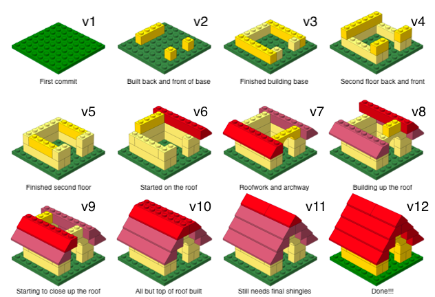

layout: true

<div class="my-footer">
<span>
<a href="http://datasciencebox.org" target="_blank">datasciencebox.org</a>
</span>
</div> 


---

```{r packages, echo=FALSE, message=FALSE, warning=FALSE}
library(tidyverse)
library(fontawesome)
```

## Agenda 

- Reproducible data analysis 
- R and RStudio 
- R Markdown 
- Git and GitHub

---

class: center, middle

## Reproducible data analysis

---

## Reproducibility checklist

.question[
What does it mean for a data analysis to be "reproducible"?
]

--

**Near-term goals:**

- Are the tables and figures reproducible from the code and data?
- Does the code actually do what you think it does?
- In addition to what was done, is it clear **why** it was done? 
(e.g., how were parameter settings chosen?)

--

**Long-term goals:**

- Can the code be used for other data?
- Can you extend the code to do other things?
---

## Toolkit

```{r fig.align="center",out.width="70%",echo=FALSE}
knitr::include_graphics("img/01/toolkit.png")
```


- Scriptability $\rightarrow$ R
- Literate programming (code, narrative, output in one place) $\rightarrow$ R Markdown
- Version control $\rightarrow$ Git / GitHub

---

class: center, middle

# R and RStudio

---

## What is R/RStudio?

- R is a statistical programming language
- RStudio is a convenient interface for R (an integrated development environment, IDE)
- At its simplest:<sup>*</sup>
    - R is like a car’s engine
    - RStudio is like a car’s dashboard

```{r fig.align="center",out.width="70%",echo=FALSE}
knitr::include_graphics("img/01/engine-dashboard.png")
```

.footnote[
*Source: [Modern Dive](https://moderndive.com/)
]

---


## R essentials (a short list)

- **Functions** are (most often) verbs, followed by what they will be applied to in parentheses:

```{r eval=FALSE}
do_this(to_this)
do_that(to_this, to_that, with_those)
```

--

- **Columns** (variables) in data frames are accessed with `$`:

```{r eval=FALSE}
dataframe$var_name
```

--

- **Packages** are installed with the `install.packages` function and loaded with the `library` function, once per session:

```{r eval=FALSE}
install.packages("package_name")
library(package_name)
```

---

## tidyverse

.pull-left[

]

.pull-right[
.center[
[tidyverse.org](https://www.tidyverse.org/)
]

- The tidyverse is an opinionated collection of R packages designed for data science. 
- All packages share an underlying philosophy and a common grammar. 
]

---

class: center, middle

# R Markdown

---


## R Markdown

- Fully reproducible reports -- the analysis is run from the beginning each time you knit

- Simple Markdown syntax for text

- Code goes in chunks, defined by three backticks, narrative goes outside of chunks

---

## How will we use R Markdown?

- Every assignment/lab/project/etc. is an R Markdown document

- You will always have a template R Markdown document to start with

- The amount of scaffolding in the template will decrease over the course of the class

--- 

## R Markdown tips

**Resources**
- [R Markdown cheat sheet](https://github.com/rstudio/cheatsheets/raw/master/rmarkdown-2.0.pdf)
- Markdown Quick Reference: 
    - `Help -> Markdown Quick Reference`
<br><br>
--


**Remember**: The workspace of the R Markdown document is <u>separate</u> from the console

---

class: center, middle

# Git and GitHub

---

## Version control

- We introduced GitHub as a platform for collaboration

- But it's much more than that...

- It's actually designed for version control

---

## Versioning

```{r echo=FALSE, fig.align = "center", out.width = "80%"}
knitr::include_graphics("img/01/lego-steps.png")
```

---

## Versioning 

with human readable messages

```{r echo=FALSE, fig.align = "center", out.width = "80%"}

```

---

### Why do we need version control?

```{r echo=FALSE, fig.align = "center", out.width="50%"}
knitr::include_graphics("img/01/phd_comics_vc.gif")
```

---

## Git and GitHub tips

- **Git** is a version control system -- like “Track Changes” features from Microsoft Word. 

--

- **GitHub** is the home for your Git-based projects on the internet (like DropBox but much better).

--

- There are a lot of Git commands and very few people know them all. 99% of the time you will use git to add, commit, push, and pull.

---

## Git and GitHub tips

- We will be doing git things and interfacing with GitHub through RStudio
    - If you Google for help you might come across methods for doing these things in the command line -- skip that and move on to the next resource unless you feel comfortable trying it out.

--

- There is a great resource for working with git and R: [happygitwithr.com](http://happygitwithr.com/).
    - Some of the content in there is beyond the scope of this course, but it's a good place to look for help.

---

## Recap 

Can you answer these questions? 

- What is a reproducible data analysis, and why is it important?
- What is version control, and why is it important?
- What is R vs. RStudio? 
- What is git vs. GitHub? 

---

## Installing R

Please be patient! This process may be time-consuming and stressful, but it is necessary for the rest of the course!

1. Go to the [CRAN website](http://lib.stat.cmu.edu/R/CRAN/) and click on the appropriate link under "Download and Install R"

  1.1 If you are Windows, click "Install R for the first time", then "Download R-4.2.1 for Windows"
  
  1.1 If you use a Mac, check your Mac OS system (Apple icon -> About this Mac -> Overview -> Version xxx). Then on the website, click the newest release that supports your current OS version. 
  
  For example, if I have Version 10.14.6, I will choose the "R-3.6.3.nnpkg" because is it "for OS X 10.11 (El Capitan) and higher, whereas the next version is for macOS 11.
  
---

## Installing R (cont.)

<ol start = 2>
<li> A file will download (most likely to your *Downloads* folder). Run the file by clicking on it. Allow the app to make changes to your device if prompted.

<li> Follow the installation instructions, until you click on "Finish" to exit the installation setup. 

```{r echo = F, out.width="50%", fig.align="center"}
knitr::include_graphics("img/00/R_wizard.png")
```

At this point, R should be successfully installed.

---

## Installing RStudio Desktop

1. Go to the [RStudio](https://www.rstudio.com/) website

2. Click on "Download" in the top-right corner

3. Click on "Download" under the RStudio Desktop Open Source License (Free)

4. Download RStudio Desktop recommended for your computer

  4.1 For Mac users: If you have macOS 10.15+, you can click the corresponding download button on this page. Otherwise, if you have at least macOS 10.12, click on "older version of Rstudio", find "2022.02.3" and click "Installers". Click on the link next to "MacOS" 
  
5. Run the downloaded RStudio Executable file until you hit the "Finish" button. It may be the case that you don't have to click anything at all.

---

## Installing RStudio Desktop (cont.)

- After RStudio finishes downloading, a window like this might pop up:

```{r echo = F, out.width="50%", fig.align="center"}
knitr::include_graphics("img/00/RStudio_download.png")
```

If so, go ahead and drag the RStudio icon into the Applications folder.
  
  
---

## Opening RStudio

- For ease of access, put the RStudio shortcut onto your dock or homescreen (*Applications* folder -> Drag the icon for **RStudio** to your dock or homescreen)

- To use, simply click on the RStudio icon (you do not need to click on the **R** icon)

---

## Before next class 

- Accept the invite to join `math118-fall2022` organization on GitHub TODAY!! 

- If you have not already done so "Getting to know you" survey on Canvas - due end of today today!

  - After filling out the survey, [schedule](https://calendly.com/beckytang/10min) a brief 1:1 meeting with me! 

- Start Reading 01 posted on the course schedule - due Mon, 9/19 

---

class: center, middle

## Application Exercise 01 


    