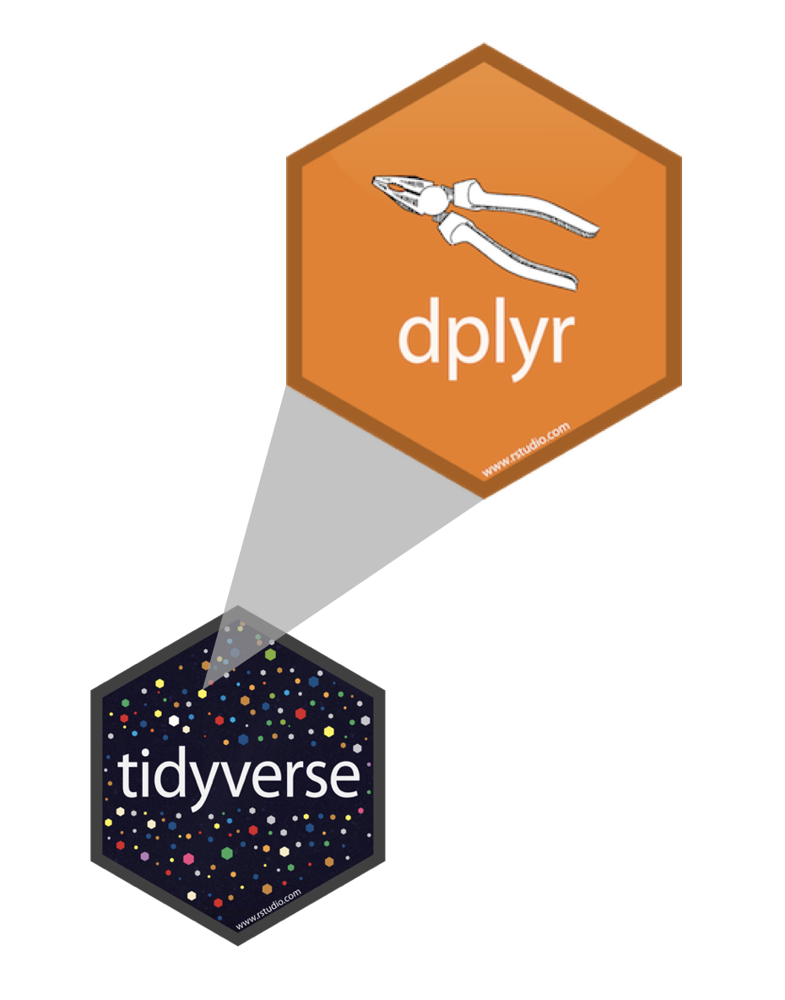

layout: true

<div class="my-footer">
<span>
<a href="http://datasciencebox.org" target="_blank">datasciencebox.org</a>
</span>
</div> 

---


```{r packages, echo=FALSE, message=FALSE, warning=FALSE}
library(tidyverse)
library(magick)
```

```{r setup, include=FALSE}
# R options
options(
  htmltools.dir.version = FALSE, # for blogdown
  show.signif.stars = FALSE,     # for regression output
  warm = 1
  )
# Set dpi and height for images
knitr::opts_chunk$set(fig.height = 2.5, fig.width = 5, dpi = 300, 
                      warning = FALSE, 
                      message = FALSE) 
# ggplot2 color palette with gray
color_palette <- list(gray = "#999999", 
                      salmon = "#E69F00", 
                      lightblue = "#56B4E9", 
                      green = "#009E73", 
                      yellow = "#F0E442", 
                      darkblue = "#0072B2", 
                      red = "#D55E00", 
                      purple = "#CC79A7")
htmltools::tagList(rmarkdown::html_dependency_font_awesome())
# For magick
dev.off <- function(){
  invisible(grDevices::dev.off())
}
# For ggplot2
ggplot2::theme_set(ggplot2::theme_bw())
```


class: center, middle

# Tidy data

---

## Tidy data

>Happy families are all alike; every unhappy family is unhappy in its own way. 
>
>Leo Tolstoy
--

.pull-left[
**Characteristics of tidy data:**

- Each variable forms a column.
- Each observation forms a row.
- Each type of observational unit forms a table.
]
--
.pull-right[
**Characteristics of untidy data:**

!@#$%^&*()
]

---

## 

.question[
What makes this data not tidy?
]

```{r hyperwar-airplanes-on-hand, echo=FALSE, out.width="80%", fig.align = "center", fig.cap = "WW2 Army Air Force combat aircraft from [Army Air Forces Statistical Digest, WW II](https://www.ibiblio.org/hyperwar/AAF/StatDigest/aafsd-3.html)"}
knitr::include_graphics("img/04/untidy-data/hyperwar-airplanes-on-hand.png")
```

---

.question[
What makes this data not tidy?
]

<br>

```{r us-general-economic-characteristic-acs-2017, echo=FALSE, out.width="90%", fig.align = "center", fig.cap = "[US Census Fact Finder, General Economic Characteristics, ACS 2017](https://factfinder.census.gov/faces/tableservices/jsf/pages/productview.xhtml?pid=ACS_17_5YR_DP03&src=pt)"}
knitr::include_graphics("img/04/untidy-data/us-general-economic-characteristic-acs-2017.png")
```

---

## Summary tables 

.question[
Is each of the following a dataset or a summary table?
]

.midi[
.pull-left[
```{r echo=FALSE}
starwars %>%
  select(name, height, mass)
```
]
.pull-right[
```{r echo=FALSE}
starwars %>%
  group_by(gender) %>%
  summarize(
    avg_height = mean(height, na.rm = TRUE) %>% round(2)
  )
```
]
]

---

## Displaying data

```{r eval=FALSE}
starwars %>%
  select(name, height, mass)
```

--

<br> 

## Summarizing data

```{r eval=FALSE}
starwars %>%
  group_by(gender) %>%
  summarize(
    avg_height = mean(height, na.rm = TRUE) %>% round(2)
  )
```

---

class: center, middle

# Grammar of data wrangling

---

## A grammar of data wrangling...

... based on the concepts of functions as verbs that manipulate data frames

.pull-left[
```{r dplyr-part-of-tidyverse, echo=FALSE, out.width="70%", fig.align = "center", caption = "dplyr is part of the tidyverse"}

```
]
.pull-right[
.small[
- `select`: pick columns by name
- `arrange`: reorder rows
- `slice`: pick rows using index(es)
- `filter`: pick rows matching criteria
- `distinct`: filter for unique rows
- `mutate`: add new variables
- `summarise`: reduce variables to values
- `group_by`: for grouped operations
- ... (many more)
]
]

---

## Rules of **dplyr** functions

- First argument is *always* a data frame

- Subsequent arguments say what to do with that data frame

- Always return a data frame

---

## Data: Hotel bookings

- Data from Kaggle: In 2017, Kaggle conducted an industry-wide survey to establish a comprehensive view of the state of data science and machine learning.

  - https://www.kaggle.com/datasets/kaggle/kaggle-survey-2017/
  
- Observations: Each row represents a different survey respondent

```{r message=FALSE}
datascience <- read_csv("data/kaggle_survey_subset.csv", show_col_types = F) 
```

---

## First look: Variables

```{r message=FALSE}
names(datascience)
```

---

## Second look: Overview

```{r}
glimpse(datascience)
```

---

## Select a single column

View only the `Age`:

--
.pull-left[
```{r}
datascience %>%
  select(Age)
```
]
--
.pull-right[
- Start with a data frame
- Pass it to the `select()` function.
- Argument is variable we want to select: `Age`
- The result is a data frame with 2,657 and 1 column: --dplyr functions always 
expect a data frame and always yield a data frame.
]

---

## Select multiple columns


View only the `Age` type and `Major`:

--

.pull-left[
```{r}
datascience %>%
  select(Age, Major)
```
]
--
.pull-right[
.discussion[
What if we wanted to select these columns, and then arrange the data in descending order of Age?
]
]

---

## Data wrangling, step-by-step

.pull-left[
.vocab[Select:]
```{r}
datascience %>%
  select(Age, Major)
```
]

--
.pull-right[
.vocab[Select, then arrange:]
```{r}
datascience %>%
  select(Age, Major) %>%
  arrange(desc(Age))
```
]

---

## What's happening here?

```{r}
datascience %>%
  select(Age, Major) %>%
  arrange(Major)
```

---


class: middle, center

# Pipes

---

## What is a pipe?

In programming, a pipe is a technique for passing information from one process to another.

--

.pull-left[
- Start with the data frame `datasccience`, and pass it to the `select()` function,
]
.pull-right[
.small[
```{r}
datascience %>% #<<
  select(Age, Major) %>%
  arrange(desc(Age))
```
]
]

---

## What is a pipe?

In programming, a pipe is a technique for passing information from one process to another.

.pull-left[
- Start with the data frame `datascience`, and pass it to the `select()` function,
- then we select the variables `Age` and `Major`,
]
.pull-right[
.small[
```{r}
datascience %>%
  select(Age, Major) %>% #<<
  arrange(desc(Age))
```
]
]

---

## What is a pipe?

In programming, a pipe is a technique for passing information from one process to another.

.pull-left[
- Start with the data frame `datascience`, and pass it to the `select()` function,
- then we select the variables `Age` and `Major`,
- and then we arrange the data frame by `Age` in descending order.
]
.pull-right[
.small[
```{r}
datascience %>%
  select(Age, Major) %>% 
  arrange(desc(Age)) #<<
```
]
]

---

## How does a pipe work?

- You can think about the following sequence of actions - find keys,  start car, drive to work, park.

--
- Expressed as a set of nested functions in R pseudocode this would look like:
```{r eval=FALSE}
park(drive(start_car(find("keys")), to = "work"))
```

--
- Writing it out using pipes give it a more natural (and easier to read)
structure:
  - Read the pipe as "and then"
```{r eval=FALSE}
find("keys") %>%
  start_car() %>%
  drive(to = "work") %>%
  park()
```

---

## What about other arguments?

Use the dot to

- send results to a function argument other than first one or 
- use the previous result for multiple arguments

```{r out.height = "20%", fig.align='center'}
datascience %>%
  filter(Major == "Computer Science") %>%
  ggplot(., aes(x = Age)) + #<<
  geom_histogram(bins = 10)
```

---

class: middle, center

# Working with a single data frame

---

class: middle

### You have a single data frame, and you want to process it and prepare it for anlaysis! 


---

## `select` to keep variables

```{r}
datascience %>%
  select(Age, Major) #<<
```

---

## `select` to exclude variables

.small[
```{r}
datascience %>%
  select(-Age) #<<
```
]

---

## `select` a range of variables

```{r}
datascience %>%
  select(Gender:EmploymentStatus) #<<
```

---

## `arrange` in ascending / descending order

.pull-left[
```{r}
datascience %>%
  select(Age, Gender) %>%
  arrange(Age) #<<
```
]
.pull-right[
```{r}
datascience %>%
  select(Age, Gender) %>%
  arrange(desc(Age)) #<<
```
]

---

## `slice` for certain row numbers

.midi[
```{r}
# first five
datascience %>%
  slice(1:5) #<<
```
]

---

.tip[
In R, you can use the `#` (hashtag or pound sign, depending on your age for adding comments to your code. 
Any text following `#` will be printed as is, and won't be run as R code.
This is useful for leaving comments in your code and for temporarily disabling 
certain lines of code while debugging.
]

.small[
```{r}
datascience %>%
  # slice the first five rows  # this line is a comment
  #select(Age) %>%           # this one doesn't run
  slice(1:5)                   # this line runs
```
]

---

## `slice` for certain row numbers

.midi[
```{r}
# last five
last_row <- nrow(datascience) # nrow() gives the number of rows in a data frame
datascience %>%
  slice((last_row - 4):last_row) #<<
```
]

---

## `filter` to select a subset of rows

.midi[
```{r}
# respondents majoring in CS
datascience %>%
  filter(Major  == "Computer Science") #<<
````
]

---

## `filter` for many conditions at once

```{r}
datascience %>%
  filter( 
    Major == "Computer Science",     #<<
    Age == 30    #<<
    ) %>% 
  select(Major, Age)
```

---

## `filter` for more complex conditions

```{r}
datascience %>%
  filter( 
    Major == "Computer Science" | Major == "Other",   # | means or  #<<
    Age == 30,    #<<
    ) %>% 
  select(Major, Age)
```

---

## Logical operators in R

<br>

operator    | definition                   || operator     | definition
------------|------------------------------||--------------|----------------
`<`         | less than                   ||`x`&nbsp;&#124;&nbsp;`y`     | `x` OR `y` 
`<=`        |	less than or equal to        ||`is.na(x)`    | test if `x` is `NA`
`>`         | greater than                 ||`!is.na(x)`   | test if `x` is not `NA`
`>=`        |	greater than or equal to     ||`x %in% y`    | test if `x` is in `y`
`==`        |	exactly equal to             ||`!(x %in% y)` | test if `x` is not in `y`
`!=`        |	not equal to                 ||`!x`          | not `x`
`x & y`     | `x` AND `y`                  ||              |

---

class: middle, center

## Demo

---

```{r include=FALSE}
options(dplyr.print_max = 20)
```


## `distinct` to filter for unique rows

... and `arrange` to order alphabetically. Note which variables are kept in the resulting data frame!

.small[
.pull-left[
```{r}
datascience %>% 
  distinct(EmployerIndustry) %>% #<<
  arrange(EmployerIndustry)
```
]

.pull-right[
```{r}
datascience %>% 
  distinct(Country, EmployerIndustry) %>% #<<
  arrange(Country, EmployerIndustry)
```
]
]

---

## `count` to create frequency tables

.pull-left[
```{r}
# alphabetical order by default
datascience %>%
  count(EmployerIndustry) #<<
```
]
--
.pull-right[
```{r}
# descending frequency order
datascience %>%
  count(EmployerIndustry, 
        sort = TRUE) #<<
```
]

---

## `count` and `arrange`

.pull-left[
```{r}
# ascending frequency order
datascience  %>%
  count(EmployerIndustry) %>%
  arrange(n) #<<
```
]
.pull-right[
```{r}
# descending frequency order
# just like adding sort = TRUE
datascience %>%
  count(EmployerIndustry) %>%
  arrange(desc(n)) #<<
```
]

---

## `count` for multiple variables

```{r}
datascience %>%
  count(EmploymentStatus, EmployerIndustry) #<<
```

---

## order matters when you `count`

.midi[
.pull-left[
```{r}
datascience %>%
  count(Country, Age) #<<
```
]
.pull-right[
```{r}
datascience %>%
  count(Age, Country)  #<<
```
]
]

---

class: middle, center

## Demo

---

## `mutate` to add a new variable

```{r}
datascience %>%
  mutate(compensation_1k = CompensationAmount/1000) %>% #<<
  select(compensation_1k, CompensationAmount)
```

---

.discussion[
What is happening in the following chunk?
]

.midi[
```{r}
datascience %>%
  count(FormalEducation, EmploymentStatus) %>%
  mutate(prop = n / sum(n))
```
]

---

## `summarise` for summary stats

```{r}
# mean average daily rate for all bookings
datascience %>%
  summarise(mean_age = mean(Age)) #<<
```

--

.tip[
`summarise()` changes the data frame entirely, it collapses rows down to a single 
summary statistics, and removes all columns that are irrelevant to the calculation.
]

---

.tip[
`summarise()` also lets you get away with being sloppy and not naming your new 
column, but that's not recommended!
]

.midi[
.pull-left[


```{r}
datascience %>%
  summarise(mean(Age)) 
```
]

.pull-right[

```{r}
datascience %>%
  summarise(mean_age = mean(Age)) 
```
]
]
---

## `group_by` for grouped operations

```{r}
# mean age for each category of employment status
datascience %>%
  group_by(EmploymentStatus) %>% #<<
  summarise(mean_age = mean(Age))
```

---

## Calculating frequencies

The following two give the same result, so `count` is simply short for `group_by` then determine frequencies 

.pull-left[
```{r}
datascience %>%
  group_by(EmployerIndustry) %>%
  summarise(n = n())
```
]
.pull-right[
```{r}
datascience %>%
  count(EmployerIndustry)
```
]

---

## Multiple summary statistics

`summarise` can be used for multiple summary statistics as well

```{r}
datascience %>%
  summarise(
    mean_age = mean(Age),
    median_age = median(Age),
    max_age = max(Age)
    )
```

---

class: middle, center

## Demo


