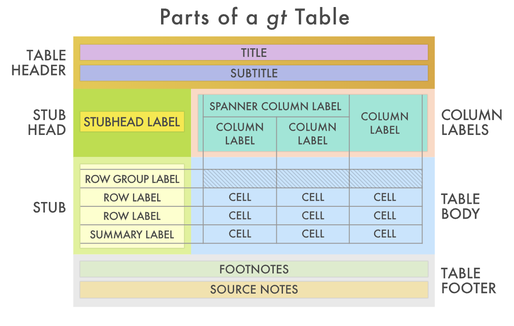
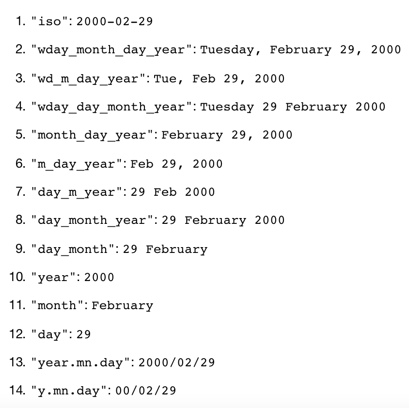

```{r echo=FALSE, message=FALSE, warning=FALSE}
library(tidyverse)
library(magick)
knitr::opts_chunk$set(warning = F,message = F,
                      fig.align = "center") 
data("iris")
```

class: center, middle

## Making pretty tables

---


## Tables

- Effectively communicating results is extremely important part of your analysis

- Communication happens through a combination of text, data visualization, and tables

--

- There are many packages dedicated to displaying tables, but we will only introduce a few of them

  - `kable`
  - `DT`
  - `gt`

---

## Default output

- By default, any data frame that you call in a code chunk is displayed using the data frame printing method set in the YAML

```{r}
iris
```

---

## `kable`

```{r}
library(knitr)
library(kableExtra)
iris %>%
  kable() #<<
```

---

```{r}
iris %>%
  kable() %>%
  kable_styling(latex_options = "striped", font_size = 8) #<<
```
---

```{r}
iris %>%
  kable(align = "c") %>% #<<
  kable_styling(latex_options = "striped", font_size = 8) 
```

---

- The `row_spec()` and `column_spec()` functions can be used to style individual rows and columns

```{r eval = F}
iris %>%
  slice(1:5) %>%
  kable() %>%
  row_spec(1, bold = TRUE, italic = TRUE) %>% #<<
  row_spec(2:3, color = 'white', background = 'black') %>% #<<
  column_spec(5, strikeout = TRUE) #<<
```

---

```{r eval = T, echo = F}
iris %>%
  slice(1:5) %>%
  kable() %>%
  row_spec(1, bold = TRUE, italic = TRUE) %>% #<<
  row_spec(2:3, color = 'white', background = 'black') %>% #<<
  column_spec(5, strikeout = TRUE) #<<
```

- Easy functionality and syntax

---

# DT

- The `DT` package provides an `R` interfact for a JavaScript library called DataTables

- Provides filtering, pagination, sorting, and other features 

  - Great for sharing raw data in presentation

```{r eval = F}
library(DT)
datatable(iris)
```

---

```{r echo = F}
library(DT)
datatable(iris)
```

---

```{r}
datatable(iris, 
          options = list(pageLength = 5)) #<<
```

---

```{r}
datatable(iris, 
          options = list(pageLength = 5),
          rownames = F) #<<
```

---

```{r}
datatable(iris, 
          options = list(pageLength = 5),
          class = 'cell-border stripe') #<<
```

---

```{r}
datatable(iris, 
          options = list(pageLength = 5),
          colnames = c("sepal_length" = 1)) #<<
```
---

```{r}
datatable(iris, 
          options = list(pageLength = 5),
          colnames = c("sepal_length" = "Sepal.Length")) #<<
```

---

```{r}
datatable(
  head(iris),
  caption = 'Table 1: This is a simple caption for the table.' #<<
)
```

---

## gt() Package

- If you don't need the filtering functionality and are more focused on beauty, the `gt()` package may be useful!

- Can modify locations of each component, format text and background shading, add titles, captions, etc.


```{r echo = F, out.width = "50%"}

```

.footnote[
*Source: https://gt.rstudio.com/
]

---

```{r}
library(gt)
iris %>%
  gt()
```

---

```{r}
iris %>%
  gt() %>%
  tab_header(title = "Iris data") #<<
```


---

- Note, there is not an easy way to paginate. We can instead do the following:

```{r}
iris %>% 
  gt_preview(top_n = 4, bottom_n = 2) #<<
```

--

- Thus, `gt()` may be preferred for displaying summaries/results or smaller datasets

---

```{r}
data(exibble)
exibble %>%
  gt()
```

---

```{r}
exibble %>%
  arrange(desc(currency)) %>%
  gt()
```
---

## Formating decimal places

```{r}
exibble %>%
  gt() %>%
  fmt_number(columns = c("num"), decimals = 2) #<<
```

---

## Formatting date style

```{r echo = F, out.width = "50%"}

```

---

```{r}
exibble %>%
  gt() %>%
  fmt_number(columns = "num", decimals = 2) %>%
  fmt_date(columns = "date", date_style = 6)#<<
```


---

## Other functions

- `fmt_time()` will change the way time data is displayed

- `fmt_datetime()` will change the way date-time values are displayed

- `fmt_currency()` can give appropriate labels or currency code

- And so many more `fmt_*()` functions!

---

# Adding new parts

- Adding new parts to the table is typically done by using a few `tab_*()` functions.

```{r eval = F}
exibble %>%
  gt() %>%
  fmt_number(columns = "num", decimals = 2) %>%
  fmt_date(columns = "date", date_style = 6) %>%
  tab_header( #<<
    title = "This is the exibble dataset in **gt**", #<<
    subtitle = "It is one of six datasets in the package" #<<
  ) 
```

---

```{r echo = F}
exibble %>%
  gt() %>%
  fmt_number(columns = "num", decimals = 2) %>%
  fmt_date(columns = "date", date_style = 6) %>%
  tab_header(
    title = ("This is the exibble dataset in **gt**"),
    subtitle = "It is one of six datasets in the package"
  ) 
```

---

```{r eval = F}
exibble %>%
  gt() %>%
  fmt_number(columns = "num", decimals = 2) %>%
  fmt_date(columns = "date", date_style = 6) %>%
  tab_header(
    title = md("This is the exibble dataset in **gt**"), #<<
    subtitle = "It is one of six datasets in the package"
  ) %>%
  tab_source_note(md("More information is available at `?exibble`.")) #<<
```

---

```{r echo = F}
exibble %>%
  gt() %>%
  fmt_number(columns = "num", decimals = 2) %>%
  fmt_date(columns = "date", date_style = 6) %>%
  tab_header(
    title = md("This is the exibble dataset in **gt**"), #<<
    subtitle = "It is one of six datasets in the package"
  ) %>%
  tab_source_note(md("More information is available at `?exibble`."))
```

---

# Grouping

- If your data has natural grouping, we can separate the data by each group

- Conveniently, the variable `group` in the `exibble` data


---

```{r eval = T}
exibble %>%
  gt(groupname_col = "group") #<<
```

---

- Here, the row labels are displayed in a separate area to the left (the stub)

```{r}
exibble %>%
  gt(groupname_col = "group",
     rowname_col = "row") #<<
```

---

## Spanning

- Sometimes, we want to give a label that spans multiples columns

```{r}
exibble %>%
  gt(rowname_col = "row", groupname_col = "group") %>%
  tab_spanner(label = "Dates and Times", columns = c("date", "time", "datetime")) #<<
```

---

## Colors

```{r}
exibble %>%
  arrange(desc(currency)) %>%
  gt(rowname_col = "row", groupname_col = "group") %>%
  data_color(columns = "currency", colors = "darkgreen") #<<
```

---

## Can also include images 

```{r echo = F, cache = T}
exibble_new <- exibble %>%
  mutate(url = 
c("https://upload.wikimedia.org/wikipedia/commons/7/76/Apricot_whole444.jpg",
  "https://upload.wikimedia.org/wikipedia/commons/b/bb/Banana_on_whitebackground.jpg",
  "https://upload.wikimedia.org/wikipedia/commons/b/b4/Coconut_%28Cocos_nucifera%29.JPG",
  "https://upload.wikimedia.org/wikipedia/commons/1/1b/Durian_x.jpg",
  NA,
  "https://upload.wikimedia.org/wikipedia/commons/c/c8/Fig_%28Ficus_carica%29_fruits.jpg",
  "https://upload.wikimedia.org/wikipedia/commons/b/b5/Citrus_paradisi_%28Grapefruit%2C_pink%29.jpg",
  "https://upload.wikimedia.org/wikipedia/commons/f/f5/Honeydew.jpg")
) %>%
  dplyr::select(c("num", "url", "char", "fctr", "date","time","datetime","currency", "row", "group"))

exibble_new %>%
  mutate(log_currency = log(currency)) %>%
  dplyr::select(-currency) %>%
  arrange(desc(log_currency)) %>%
  # gt() %>%
  gt(rowname_col = "row", groupname_col = "group") %>%
  data_color(columns = "log_currency", 
             colors = scales::col_numeric(palette = c("lightgreen", "darkgreen"), domain = c(-0.85, 11.1))) %>%
  text_transform(
    #Apply a function to a column
    locations = cells_body(c(url)),
    fn = function(x) {
      #Return an image of set dimensions
      web_image(
        url = x,
        height = 22
      )
    }
  ) %>% 
  #Hide column header flag_URL and reduce width
  cols_width(c(url) ~ px(30)) %>% 
  cols_label(url = "")
``` 


---

class: center, middle

# Reshaping

---

# Why reshape?

- Sometimes, our data is not always in the format that we would like

- We want to preserve all the information, but "massage" it prior to analysis

  - Move information between rows and columns
  


---

# Types of data frames

- Data frames are often described as **wide** or **long**

- **Wide**: when a row has more than one observation, and the units of observation (e.g., individuals, countries, households) are on one row each

- **Long**: when a row has only one observation, but the units of observation are repeated down a column

---

# Long to wide data

```{r echo = F}
set.seed(1)
country_long <- data.frame(
    expand.grid(country = c("Sweden", "Denmark", "Norway"), month  = c("jan","feb", "march")),
    avgtemp = round(runif(9, 3, 12), 0)
    )
```

- `country` is our unit of observation. Suppose our original data is on the left, and we would like to reshape it to the data frame on the right


.pull-left[
```{r echo = F}
country_long
```
]

.pull-right[
```{r echo = F}
country_long %>%
  pivot_wider(names_from = month, values_from = avgtemp) 
```

- Each unit of observation (`country`) has exactly one row

]


---

# Long to wide data

- `pivot_wider()` function turns data from long to wide

- Takes two arguments:

  - `names_from`: the name of the variable(s) in the data frame to get the name of the output column
  
  - `values_from`: the name of the variable(s) in the data frame to get the cell values from

---

# Long to Wide data

.pull-left[
```{r echo = F, eval = T}
country_long 
```
]

.pull-right[
```{r echo = F}
country_long %>%
  pivot_wider(names_from = month, values_from = avgtemp) 
```

```{r eval = F}
country_long %>%
  pivot_wider(names_from = ____,
              values_from = _____)
```

.question[What should I pass in for `names_from` and `values_from`?]
]


---

```{r eval = T}
country_long %>%
  pivot_wider(names_from = month,
              values_from = avgtemp)
```

---

# Wide to long data

- Long data structure is often preferred

  - Often required for advanced statistical analysis and graphing.
  

.pull-left[
```{r echo = F}
country_wide <- data.frame(
    country = c("Sweden", "Denmark", "Norway"),
    "jan" = country_long$avgtemp[1:3],
    "feb" = country_long$avgtemp[4:6],
    "march" = country_long$avgtemp[7:9])
country_wide 
```
]

.pull-right[
```{r}
country_wide %>%
  pivot_longer(cols = 2:4, names_to = "month", values_to = "avg_temp")
```
]

---

# Wide to Long data

- `pivot_longer()` function can be used to go from wide to long data

- Takes three arguments:

  - `cols`: specify which columns in the dataframe to pivot into longer format
  
  - `names_to`: a string (your choice) specifying the name of the new column created from the column names species by `cols`
  
  - `values_to`: a string (your choice) specifying the name of the column to create from the data stored in cell values


---

# Wide to Long data

```{r}
country_wide
```

--

- `cols`: the columns `jan`, `feb`, and `march`

- `names_to`: anything you'd like, so long as it makes sense. I will choose "month"

- `values_to`: anything you'd like, so long as it makes sense. I will choose "avg_temp"

---

```{r}
country_wide %>%
  pivot_longer(cols = c("jan", "feb", "march"), 
               names_to = "month",
               values_to = "avg_temp")
```

---

```{r}
country_wide %>%
  pivot_longer(cols = 2:4, #<< 
               names_to = "month",
               values_to = "temp") #<<
```

---

# Example: air quality data

```{r echo = F}
data(airquality)
head(airquality)
```

.question[
Is this dataframe in wide or long format?
]


