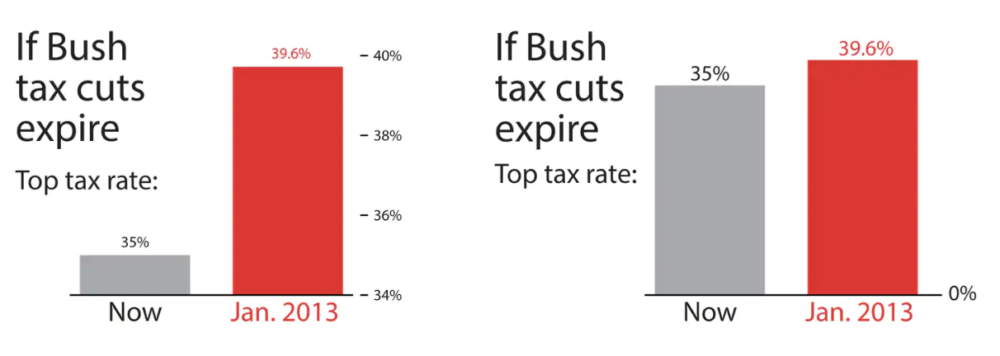
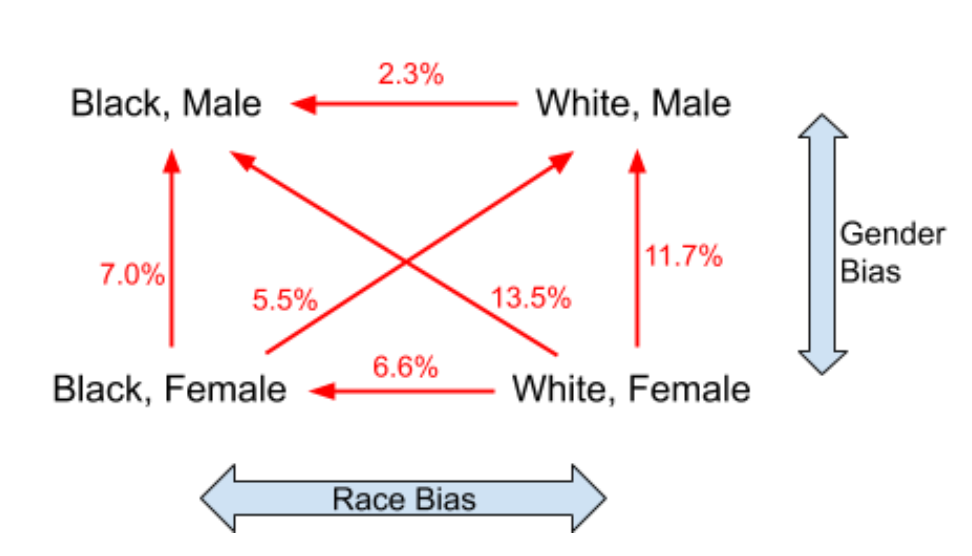
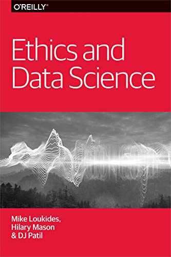

layout: true

<div class="my-footer">
<span>
<a href="http://datasciencebox.org" target="_blank">datasciencebox.org</a>
</span>
</div> 

---

```{r setup, include=FALSE}
# R options
options(
  htmltools.dir.version = FALSE, # for blogdown
  show.signif.stars = FALSE,     # for regression output
  warm = 1
  )
# Set dpi and height for images
knitr::opts_chunk$set(fig.height = 3, fig.width = 5, dpi = 300, 
                      warning = FALSE, 
                      message = FALSE, 
                      echo = FALSE,
                      fig.align = "center") 
# ggplot2 color palette with gray
color_palette <- list(gray = "#999999", 
                      salmon = "#E69F00", 
                      lightblue = "#56B4E9", 
                      green = "#009E73", 
                      yellow = "#F0E442", 
                      darkblue = "#0072B2", 
                      red = "#D55E00", 
                      purple = "#CC79A7")
htmltools::tagList(rmarkdown::html_dependency_font_awesome())
# For magick
dev.off <- function(){
  invisible(grDevices::dev.off())
}
# For ggplot2
ggplot2::theme_set(ggplot2::theme_bw())
```

```{r packages, echo=FALSE, message=FALSE, warning=FALSE}
library(tidyverse)
```


## Topics

 - Misrepresenting data

 - Algorithmic bias

 - Privacy?
 
 - Simpson's paradox

---

class: middle, center

## Misrepresenting data

---

.question[
What is the difference between these two pictures? Which presents a better way to represent these data?
]

<br>

```{r echo=FALSE, out.width="80%"}

```


.footnote[Ingraham, C. (2019) ["You’ve been reading charts wrong. Here’s how a pro does it."](https://www.washingtonpost.com/business/2019/10/14/youve-been-reading-charts-wrong-heres-how-pro-does-it/), The Washington Post, 14 Oct.]


---

.question[
Is this visualization telling the complete story? What's missing?
]

```{r echo=FALSE, out.width = "50%"}
  
```

.footnote[Credit: [Statistics How To](https://www.statisticshowto.com/probability-and-statistics/descriptive-statistics/misleading-graphs/)]


---

class: middle, center

## Algorithmic bias

---

class: middle, center

## The Hathaway Effect

---

```{r out.width = "50%", echo = FALSE}

```

.footnote[["Does Anne Hathaway News Drive Berkshire Hathaway's Stock?"](https://www.theatlantic.com/technology/archive/2011/03/does-anne-hathaway-news-drive-berkshire-hathaways-stock/72661/)]

---

## The Hathaway Effect

- **Oct. 3, 2008** - Rachel Getting Married opens: .vocab[BRK.A up .44%]

- **Jan. 5, 2009** - Bride Wars opens: .vocab[BRK.A up 2.61%]

- **Feb. 8, 2010** - Valentine’s Day opens: .vocab[BRK.A up 1.01%]

- **March 5, 2010** - Alice in Wonderland opens: .vocab[BRK.A up .74%]

- **Nov. 24, 2010** - Love and Other Drugs opens: .vocab[BRK.A up 1.62%]

- **Nov. 29, 2010** - Anne announced as co-host of the Oscars: .vocab[BRK.A up .25%]

.footnote[[The Hathaway Effect: How Anne Gives Warren Buffet a Rise](https://www.huffpost.com/entry/the-hathaway-effect-how-a_b_830041)]
---

## Amazon's experimental hiring algorithm

- Used AI to give job candidates scores ranging from one to five stars - much like shoppers rate products on Amazon, some of the people said
- Company realized its new system was not rating candidates for software developer jobs and other technical posts in a gender-neutral way
- Amazon’s system taught itself that male candidates were preferable

>Gender bias was not the only issue. Problems with the data that underpinned the models’ judgments meant that unqualified candidates were often recommended for all manner of jobs, the people said.
.footnote[Dastin, J. (2018) [Amazon scraps secret AI recruiting tool that showed bias against women](https://reut.rs/2Od9fPr), Reuters, 10 Oct.]

---

## Bias in health care risk algorithm

- Algorithm to target patients for “high-risk care management” programs that seek to improve the care of patients with complex health needs by providing additional resources
- Such program are considered effective at improving outcomes and satisfaction while reducing costs, but are themselves costly -> want to identify patients who would benefit the most 
- Algorithm’s designers used previous patients’ health care spending as a proxy for medical need
  - Assigned patients a "risk score", where higher risk meant more complex needs and therefore priority 

--

What happened: Algorithm tended to assign lower risk score to black patients

Obermeyer, Z., Powers, B., Vogeli, C., & Mullainathan, S. (2019). [Dissecting racial bias in an algorithm used to manage the health of populations](https://science.sciencemag.org/content/366/6464/447/tab-figures-data), Science.
---

## Bias in health care risk algorithm

```{r out.width = "45%"}

```

> Issue: health care spending does not equal need. 

---

### Bias in health care risk algorithm

```{r out.width = "45%"}
knitr::include_graphics("img/09/risk_expenditure.png")
```

---

### Bias in health care risk algorithm

```{r out.width = "45%"}

```


> Even though black patients tend to have more severe medical conditions, algorithm is built to predict health care costs rather than illness


---


## Bias in algorithms used for sentencing

```{r out.width = "70%"}
knitr::include_graphics("img/09/propublica-criminal-sentencing.png")
```

There’s software used across the country to predict future criminal activity. And it's biased...

[Pro Publica, May 23, 2016](https://www.propublica.org/article/machine-bias-risk-assessments-in-criminal-sentencing)

---

class: middle

>“Although these measures were crafted with the best of intentions, I am concerned that they inadvertently undermine our efforts to ensure individualized and equal justice,” he said, adding, “they may exacerbate unwarranted and unjust disparities that are already far too common in our criminal justice system and in our society.”
> Then  U.S. Attorney General Eric Holder (2014)
---

## ProPublica analysis

.vocab[Data:]

Risk scores assigned to more than 7,000 people arrested in Broward County, Florida, in 2013 and 2014 + whether they were charged with new crimes over the next two years

---

## ProPublica analysis

.vocab[Results:]

- 20% of those predicted to commit violent crimes actually did

--

- Algorithm had higher accuracy (61%) when full range of crimes taken into account (e.g. misdemeanors)

--

- Algorithm was more likely to falsely flag African American defendants as higher risk, at almost twice the rate as Caucasian defendants

```{r, out.width = "90%"}

```


---

class: middle, center 

Read more at 

[propublica.org/article/machine-bias-risk-assessments-in-criminal-sentencing](https://www.propublica.org/article/machine-bias-risk-assessments-in-criminal-sentencing).

---

class: middle, center

## Activity: Algorithmic Bias

---

## Discuss 

- Prompt: Think of a time when you have shared a photo of you and your friends to social media

  - Have you ever had to crop a photo that you shared?
  
  - How did you decide what to crop out?
  
---

## Activity

- Crop the images as if you were uploading them to social media


---


## Discuss 

- What images were challenging for you to decide how to crop?

- Which images did you and your partner crop the same (or similarly)?

- Which images did you and your partner crop differently?

--

- How might the cropping data here be biased?

- How might we address these biases?

---


## Watch

.center[
<iframe width="560" height="315" src="https://www.youtube.com/embed/Ok5sKLXqynQ" title="YouTube video player" frameborder="0" allow="accelerometer; autoplay; clipboard-write; encrypted-media; gyroscope; picture-in-picture" allowfullscreen></iframe>

Are We Automating Racism?
by Glad You Asked
]

---

## Prompt

- Using shared definition/understanding of racism, do you think the algorithm used by Twitter was responsible for prejudice, discrimination, or antagonism?

--

- How was the Twitter cropping algorithm trained? 

- According to the video, where is a potential source of bias when training similar cropping algorithms?

---

## Twitter's response

- ["Algorithmic bug bounties"](https://www.theguardian.com/technology/2021/aug/10/twitters-image-cropping-algorithm-prefers-younger-slimmer-faces-with-lighter-skin-analysis)

- Conducted an internal study using photos of celebrities from Wikidata


--

```{r out.width="70%"}

```

.footnote[Source (and read more here): https://arxiv.org/abs/2105.08667]

---

class: middle, center

## Privacy

---

## OK Cupid Data Breach

- In 2016, researchers published data of 70,000 OkCupid users—including usernames, political leanings, drug usage, and intimate sexual details.

>"Some may object to the ethics of gathering and releasing this data. However, all the data found in the dataset are or were already publicly available, so releasing this dataset merely presents it in a more useful form.""
> Researchers Emil Kirkegaard and Julius Daugbjerg Bjerrekær
- Although the researchers did not release the real names and pictures of the OkCupid users, critics noted that their identities could easily be uncovered from the details provided—such as from the usernames.

<br>

<small>[*OKCupid Study Reveals the Perils of Big-Data Science*](https://www.wired.com/2016/05/okcupid-study-reveals-perils-big-data-science/)</small>

---

class: middle

.question[
In analysis of data individuals willingly shared publicly on a given platform (e.g. social media data), how do you make sure you don't violate reasonable expectations of privacy?
]

```{r out.width = "70%", echo = FALSE}

```
---


## Facebook & Cambridge Analytica

```{r out.width = "60%", echo = FALSE}
knitr::include_graphics("img/09/facebook-cambridge-analytica-explained.jpg")
```

<br>

[How Cambridge Analytica turned Facebook 'likes' into a lucrative political tool](https://www.theguardian.com/technology/2018/mar/17/facebook-cambridge-analytica-kogan-data-algorithm)

---

class: middle, center

## Simpson's paradox

---

## Simpson's paradox

- Not considering an important variable when studying a relationship can result in <font class="vocab">Simpson's paradox</font>, a phenomenon in which the omission of one explanatory variable can affect the measure of association between another explanatory variable and a response variable. 


- In other words, the inclusion of a third variable in the analysis can change the apparent relationship between the other two variables. 

---

## Simpson's paradox

```{r simpsons_plot, echo=FALSE, message=FALSE,fig.align="center", fig.height=2, fig.width=3}
df <- tribble(
  ~x1, ~y, ~x2,
  2,   4,  0,
  3,   3,  0,
  4,   2,  0,
  5,   1,  0,
  6,   11, 1,
  7,   10, 1,
  8,   9,  1,
  9,   8,  1
)
ggplot() +
  geom_point(data = df, aes(x1, y)) +
  geom_smooth(data = df, aes(x1, y), method = lm, se = FALSE, 
              color = "black", linetype = "dashed")
```

---

## Simpson's paradox 

```{r simpsons_plot2, echo=FALSE, message=FALSE,fig.align="center", fig.height=2, fig.width=3}
ggplot() +
  geom_point(data = df, aes(x1, y, color = factor(x2))) +
  geom_smooth(data = df, aes(x1, y, color = factor(x2)), method = lm) +
  geom_smooth(data = df, aes(x1, y), method = lm, se = FALSE, 
              color = "black", linetype = "dashed") +
  labs(color = "x2")
```

---

## Berkeley Admissions

UC Berkeley admission figures for Fall of 1973:

| | Admit | Deny | Total |
|----|----|-----|-----|
|Men | 3738 |  4704 | 8442|
|Women| 1494 | 2827 | 4321 |
|Total| 5232 | 7531 | 12763|

<br>

.question[
- What is probability of admission?
]

--

.question[
$P(\text{admission}) = \dfrac{\text{# admitted}}{\text{# applied}} = \dfrac{5232}{12763} \approx 0.41$
]

---


## Practicing with probabilities

| | Admit | Deny | Total |
|----|----|-----|-----|
|Men | 3738 |  4704 | 8442|
|Women| 1494 | 2827 | 4321 |
|Total| 5232 | 7531 | 12763|

.question[
- $\small{P(\text{admit among men}) =}$ ?
- $\small{P(\text{admit among women})=}$ ? 
]

--

.question[
- $P(\text{admit among men}) = \dfrac{3738}{8442} \approx 0.44$ 
- $P(\text{admit among women}) = \dfrac{1494}{4321} \approx 0.35$ 
]

---

## Berkeley Admissions

- Study of gender bias

  - Men who applied were more likely than women to be admitted (44% vs 35%)
  
  - The difference was so large that it was unlikely to be due to chance!
  
--

- However, the data given omitted information about the departments that the people were applying to

  - We will look at the six largest departments: A, B, C, D, E, F

---

## Glimpse of data in tidy form

```{r admissions_data, echo = F}
department <- c(rep("A", 933), rep("B", 585), rep("C", 918), rep("D", 792), rep("E", 584), rep("F", 714))
apply <- c(rep("Male: Admit", 511), rep("Male: Deny", 314 ), rep("Female: Admit", 89), rep("Female: Deny", 19),
           rep("Male: Admit", 353), rep("Male: Deny", 207 ), rep("Female: Admit", 17), rep("Female: Deny", 8),
           rep("Male: Admit", 120), rep("Male: Deny", 205 ), rep("Female: Admit", 202), rep("Female: Deny", 391),
           rep("Male: Admit", 138), rep("Male: Deny", 279 ), rep("Female: Admit", 131), rep("Female: Deny", 244),
           rep("Male: Admit", 54), rep("Male: Deny", 137 ), rep("Female: Admit", 94), rep("Female: Deny", 299),
           rep("Male: Admit", 22), rep("Male: Deny", 351 ), rep("Female: Admit", 24), rep("Female: Deny", 317))

admissions <- data.frame(department = factor(department), apply = apply) %>% 
  mutate(gender = if_else(str_detect(apply, "Female"), "female", "male"), 
         decision = if_else(str_detect(apply, "Admit"), "admit", "deny")) %>%
  mutate(decision = factor(decision, levels = c("deny", "admit"))) %>%
  dplyr::select(-apply) 
```

```{r glimpse_berkley}
glimpse(admissions)
```

.footnote[
[https://en.wikipedia.org/wiki/Simpson%27s_paradox](https://en.wikipedia.org/wiki/Simpson%27s_paradox)
]

---

## Overall distribution of acceptance by gender

.question[
  What type of visualization would be appropriate for representing this data?
]

```{r berkley_prop}
admissions %>%
  count(gender, decision) %>%
  group_by(gender) %>%
  mutate(prop_admit = n / sum(n))
```

---

## Overall distribution of acceptance

```{r berkley_hist, echo = F, fig.width=8, fig.height=4}
ggplot(admissions, mapping = aes(x = gender, fill = decision))+
  geom_bar(position = "fill") +
  labs(y = "", title = "Admission decisions by gender")+
  theme(text = element_text(size = 20))
```

---


## Closer look

Let's look at data from the six largest departments, labeled A-F:

| Department | Female: Admit | Female: Total | Male: Admit | Male: Total
|------------|---------|-----|-------|------|
| A       | 89      | 108  | 511   | 825|
| B   | 17     | 25  | 353   | 560 |
| C   | 202      | 593  | 120    | 227 |
| D |  131     | 375  | 138    | 417 |
| E   | 94       | 393   | 54    | 191|
| F      | 24     | 341 | 22   | 373


---

### UC Berkeley admissions: within a given department

.question[
  Within each department, what is the probability of admittance for each gender? 
]

| Department | Female: Admit | Female: Total | Male: Admit | Male: Total|
|------------|---------|-----|-------|------|
| A       | 89      | 108  | 511   | 825|
| B   | 17     | 25  | 353   | 560 |
| C   | 202      | 593  | 120    | 227 |
| D |  131     | 375  | 138    | 417 |
| E   | 94       | 393   | 54    | 191|
| F      | 24     | 341 | 22   | 373|

---


## Distribution of acceptance by department


```{r berkley_prop_group, echo = T}
admissions %>%
  count(department, gender, decision) %>%
  group_by(department, gender) %>%
  mutate(prop_admit = n / sum(n)) 
```

---


## Distribution of acceptance by department

```{r berkley_hist_facet,fig.height=4.5, fig.width=9, echo = F}
ggplot(admissions, mapping = aes(x = gender, fill = decision))+
  geom_bar(position = "fill") +
  facet_wrap(~department) +
  labs(y = "", title = "Admission decisions by gender and department")
```

---

## UC Berkeley admissions: closer look

| Department | Female: Total | Female: Acceptance | Male: Total | Male: Acceptance |
|------------|---------|-----|-------|------|
| A       | 108      |  0.82 | 825 | 0.62 |
| B   | 25     |  0.68  | 560   | 0.63 |
| C   | 593     | 0.34  | 227    | 0.37 |
| D |  375    | 0.35  | 417    | 0.33 |
| E   | 393      | 0.24   | 191    | 0.28 |
| F      | 341     | 0.07 | 373   | 0.06 |

--


- Rank departments by total number of male applicants


- Rank departments by total number of female applicants

--

.question[Are the departments uniform in their admission rates?] 

--

  - Notice how **A** and **B** have highest acceptance! What does this mean?

---

## UC Berkeley admissions: plot

```{r bickel_plot, echo=FALSE, out.width=400, fig.align="center"}

```

<br>

.footnote[
  [https://homepage.stat.uiowa.edu/~mbognar/1030/Bickel-Berkeley.pdf](https://homepage.stat.uiowa.edu/~mbognar/1030/Bickel-Berkeley.pdf)
]


---

.question[
...smoking cigarettes can help you live longer?
]

```{r echo=FALSE, out.width = "50%"}
  
```

.footnote[ [How Charts Lie: Getting Smarter About Visual Information](https://wwnorton.com/books/9781324001560) ]

---

> Missing information


```{r echo=FALSE, out.width = "50%"}
  
```

.footnote[ [How Charts Lie: Getting Smarter About Visual Information](https://wwnorton.com/books/9781324001560) ]

---


> Simpson's paradox


```{r echo=FALSE, out.width = "50%"}

```

.footnote[ [How Charts Lie: Getting Smarter About Visual Information](https://wwnorton.com/books/9781324001560) ]

---

> Individual level


```{r echo=FALSE, out.width = "70%", fig.align='center'}

```

.footnote[ [How Charts Lie: Getting Smarter About Visual Information](https://wwnorton.com/books/9781324001560) ]

---

class: center, middle

## Further study on data science ethics

---

## Further reading


.pull-left[
```{r, out.width = "60%"}

```
]

.pull-right[
[Ethics and Data Science](https://www.amazon.com/Ethics-Data-Science-Mike-Loukides-ebook/dp/B07GTC8ZN7)  

by Mike Loukides, Hilary Mason, DJ Patil  

(free Kindle download)
]

---

## Further reading

.pull-left[
```{r, out.width = "60%"}
knitr::include_graphics("img/09/how-charts-lie.jpg")
```
]

.pull-right[
[How Charts Lie: Getting Smarter About Visual Information](https://wwnorton.com/books/9781324001560)  

by Alberto Cairo
]


---

## Further reading

.pull-left[
```{r, out.width = "60%"}
knitr::include_graphics("img/09/weapons-of-math-destruction.jpg")
```

]
.pull-right[
[Weapons of Math Destruction: How Big Data Increases Inequality and Threatens Democracy ](https://www.amazon.com/Ethics-Data-Science-Mike-Loukides-ebook/dp/B07GTC8ZN7)  

by Cathy O'Neil
]

---

## Further watching

.center[
<iframe width="560" height="315" src="https://www.youtube.com/embed/MfThopD7L1Y" frameborder="0" allow="accelerometer; autoplay; encrypted-media; gyroscope; picture-in-picture" allowfullscreen></iframe>

Predictive Policing: Bias In, Bias Out  
by Kristian Lum 
]

---

## Parting thoughts

- At some point during your data science journey you will learn tools that can be used unethically

- You might also be tempted to use your knowledge in a way that is ethically questionable either because of business goals or for the pursuit of further knowledge (or because your boss told you to do so)

.question[
How do you train yourself to make the right decisions (or reduce the likelihood of accidentally making the wrong decisions) at those points?
]

---

## Do good with data

- Data Science for Social Good:

  - [at the University of Chicago](http://www.dssgfellowship.org/)
  - [at the Alan Turing Institute](https://www.turing.ac.uk/collaborate-turing/data-science-social-good)

- [DataKind](https://www.datakind.org/): DataKind brings high-impact organizations together with leading data scientists to use data science in the service of humanity 
- [Pledge to promote data values & practices](https://datapractices.org/manifesto/)
