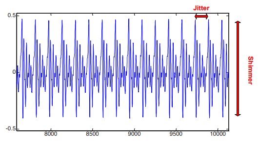

layout: true

<div class="my-footer">
<span>
<a href="http://datasciencebox.org" target="_blank">datasciencebox.org</a>
</span>
</div> 

```{r setup, include=FALSE}
# R options
options(
  htmltools.dir.version = FALSE, # for blogdown
  show.signif.stars = FALSE,     # for regression output
  warm = 1
  )
# Set dpi and height for images
knitr::opts_chunk$set(fig.height = 3, fig.width = 5, dpi = 300, 
                      warning = FALSE, 
                      message = FALSE, 
                      fig.align = "center") 
# ggplot2 color palette with gray
color_palette <- list(gray = "#999999", 
                      salmon = "#E69F00", 
                      lightblue = "#56B4E9", 
                      green = "#009E73", 
                      yellow = "#F0E442", 
                      darkblue = "#0072B2", 
                      red = "#D55E00", 
                      purple = "#CC79A7")
htmltools::tagList(rmarkdown::html_dependency_font_awesome())
# For magick
dev.off <- function(){
  invisible(grDevices::dev.off())
}
# For ggplot2
ggplot2::theme_set(ggplot2::theme_bw())
```

```{r packages, echo=FALSE, message=FALSE, warning=FALSE}
library(tidyverse)
library(broom)
library(knitr)
library(DT)
library(openintro)
library(infer)
library(patchwork)
library(kableExtra)
```

---
## Housekeeping

- Happy Halloween! 

- HW 05 due tomorrow, 11/01 at 11:59pm

- I will have abbreviated office hours today: 3-4:30pm to prepare, but feel free to stop by during my Math 218 hours tomorrow (11am-12pm)

- Second job candidate is giving talk on Wednesday, 12:30-1:30pm in 75 Shannon Street Room 224
  
  - Candidate: Adam Waterbury
  
  - Talk title: “Reinforced Chains, Stochastic Approximation, and Coexistence in Ecological Systems.”


---

## Recap

So far, we've talked about performing interval estimation and hypothesis 
testing for means using simulation-based methods

In all cases so far, we've only compared one sample against a hypothesized 
value.

.question[
But what if we wanted to compare two samples against *each other*?
]

---


class: center, middle

# Permutation tests for difference in means

---

## Two-sample inference for means

Suppose we have two (representative) samples, and wanted to either 

- estimate the .vocab[difference in means] in the two
populations 
  - confidence interval for $\mu_1 - \mu_2$
  
- Test the hypotheses

\begin{align*}
H_0: \mu_1 = \mu_2 \\
H_a: \mu_1 \neq \mu_2,
\end{align*}

where $\mu_1$ and $\mu_2$ are the population means in groups 1 and 2.

---

class: middle

.question[
How might you calculate a confidence interval and address the above hypothesis test using simulation-based methods?
]

---

## Data

```{r fig.align="center",out.width="60%",echo=FALSE}
knitr::include_graphics("img/15/spectrogram.png")
```

.footnote[Adapted from Erdogdu Sakar, B., et al. *Collection and Analysis of a Parkinson*
*Speech Dataset with Multiple Types of Sound Recordings*, IEEE Journal of 
Biomedical and Health Informatics, vol. 17(4), pp. 828-834, 2013
(image from [Wikipedia](https://en.wikipedia.org/wiki/Spectrogram))]

---

## Some voice analysis terminology

```{r fig.align="center",out.width="50%",echo=FALSE}

```

- .vocab[Jitter]: frequency variation from cycle to cycle
- .vocab[Shimmer]: amplitude variation of the sound wave

Jitter and shimmer are affected by lack of control of vocal cord vibration, and
pathological differences from average values may be indicative of Parkinson's
Disease (PD).

(from Teixeira, Oliveira, and Lopes, 2013)

---

## Question of interest

Is there a difference in average voice jitter between patients with Parkinson's disease (PD) and those who don't have Parkinson's disease (control group)? 

The `parkinsons.csv` we looked at in lab contains repeated voice recordings from a number of patients,
some with PD and some serving as non-PD controls (Erdogdu B et al.). For now,
**assume that all samples were taken independently from each other** (this is
not actually the case, but we'll make this assumption).

Jitter is given in milliseconds (ms), and shimmer is given in decibels (dB).

---

## Data

```{r, warning = F, message = F}
parkinsons <- read_csv("data/parkinsons.csv")
parkinsons %>% 
  slice(29:33)
```

- Perhaps we want to learn about the true difference in mean voice jitter between the two groups. Can achieve this via:

  - Bootstrap confidence interval
  
  - Hypothesis testing

---

class: center, middle

## Confidence interval

---

## Bootstrap estimation

Let's construct the bootstrap distribution for the **difference in means**.

```{r}
library(infer)
set.seed(2020)
boot_diffs <- parkinsons %>% 
  specify(jitter ~ status) %>% #<<
  generate(reps = 1000, type = "bootstrap") %>% 
  calculate(stat = "diff in means", 
            order = c("Healthy", "PD")) 
```

--

.question[What does the argument in `specify()` mean?. Why is it no longer of the form `specify(response = <var>)`?]

--

  - We want to look at the relationship between `jitter` and `status`, not just `jitter` alone!

--

.question[Why `specify(jitter ~ status)` and not `specify(status ~ jitter)`?]

  - We want to see how `jitter` varies by `status`, not the other way around!

---
## Bootstrap estimation

Let's construct the bootstrap distribution for the **difference in means**.

```{r}
library(infer)
set.seed(2020)
boot_diffs <- parkinsons %>% 
  specify(jitter ~ status) %>% 
  generate(reps = 1000, type = "bootstrap") %>% 
  calculate(stat = "diff in means",  #<<
            order = c("Healthy", "PD"))  #<<
```

- In `calculate()`, we now specify `stat = "diff in means"`

.question[What does this `order` argument mean? Why do we need it?]

--

  - We are taking a difference, so order matters!
  
---

## Bootstrap estimation

Let's construct the bootstrap distribution for the **difference in means**.

```{r echo = F, fig.height = 2}
ggplot(boot_diffs, aes(x = stat)) +
  geom_histogram(binwidth = 0.0001,
                 fill = "skyblue", 
                 color = "darkblue") +
  labs(x = "", y = "")
```

---

## CI for difference in means

Let's construct the 95% bootstrap confidence interval for the **difference in means**.

```{r echo = F}
ci <- boot_diffs %>% 
  summarize(lower = quantile(stat, 0.025),
            upper = quantile(stat, 0.975))
ci
```

.vocab[Interpretation: ]We are 95% confident that the mean voice jitter for people without Parkinson's disease is about 0.002 to 0.004 ms .vocab[less than] the mean voice jitter for those with Parkinson's disease.

  - Note the .vocab[order] of the interpretation! 

--

.question[
Is there evidence that there is a difference in mean voice jitter between PD patients and healthy patients?
]

---


class: center, middle

## Hypothesis testing

---

## Hypothesis testing

Let $\mu_P$ be the mean voice jitter among PD patients, and $\mu_H$ be the mean
voice jitter among healthy patients. Let's test

\begin{align*}
H_0: \mu_P = \mu_H\\
H_a: \mu_P \neq \mu_H
\end{align*}

If the two means are truly equal (i.e., if $H_0$ is true), then the difference, $\mu_H - \mu_P$, should be **zero**.

---

## Hypothesis testing

Let's construct the simulated .vocab[null distribution] for the difference in means, $\mu_H - \mu_P$. If the two means are truly equal (i.e., if $H_0$ is true), then this difference should be zero.

--

```{r}
null_dist <- parkinsons %>%
  specify(jitter ~ status) %>% #<<
  hypothesize(null = "independence") %>% 
  generate(reps = 1000, type = "permute") %>% 
  calculate(stat = "diff in means", #<<
            order = c("Healthy", "PD")) #<<
```

- Just as for confidence interval, we use `specify(jitter ~ status)` because we want to examine how mean `jitter` varies by different `status`

- We will `calculate()` the same statistic and specify the same order

---

## Hypothesis testing


```{r eval = F}
null_dist <- parkinsons %>%
  specify(jitter ~ status) %>% 
  hypothesize(null = "independence") %>% #<<
  generate(reps = 1000, type = "permute") %>% 
  calculate(stat = "diff in means", 
            order = c("Healthy", "PD")) 
```

.question[Why is it no longer the usual `hypothesize(null = "point")`?]

--

- If the difference in means is truly zero, then we would say that voice `jitter` is independent of what `status` patient you are

---

## Hypothesis testing

Let's construct the simulated .vocab[null distribution] for the difference in means, $\mu_H - \mu_P$. If the two means are truly equal (i.e., if $H_0$ is true), then this difference should be zero.

--

```{r eval = F}
null_dist <- parkinsons %>%
  specify(jitter ~ status) %>% 
  hypothesize(null = "independence") %>% 
  generate(reps = 1000, type = "permute") %>%  #<<
  calculate(stat = "diff in means", 
            order = c("Healthy", "PD")) 
```

.question[Why `type = "permute"` and not `type = "bootstrap"`?]

---

## Permuting

- Our null hypothesis is that the mean `jitter` of the two groups, `"Healthy"` and `"PD"`, are equal

- How do we create a null distribution here?

--

- If the `jitter` across the two groups is truly not different, then if I shuffled the observed `jitter` values around, split them into two groups, and looked at the the respective mean `jitter` in these new groups, .vocab[what would we expect the difference between the two means to be]?


---


## Permuting

- This idea of shuffling or rearranging the observations around is known as .vocab[permuting]

- We will use cards to understand how this works

--

```{r}
parkinsons %>%
  count(status)
```

Begin by writing each observed value `jitter` on its own card, for a total of `r nrow(parkinsons)` cards. 

---


## Permuting (cont.)


1. Shuffle the cards well and deal `r sum(parkinsons$status == "Healthy")` into one group ("Healthy"), and the remaining `r sum(parkinsons$status == "PD")` into a second group ("Parkinson's patients")

2. Calculate the means of each group $(\bar{x}_{1}, \bar{x}_{2})$, then record the difference $\bar{x}_{1} - \bar{x}_{2}$

<br>

Repeat steps 1 and 2 multiple times! This will create a null distribution of the difference in means.

--

- This is similar in spirit to bootstrap estimation, but here we **sample without replacement**; we merely permute/shuffle the labels of each of our `jitter` values.

- Permuting allows us to approximate all the possible differences in means we could have seen if 
$H_0$ were in fact true. 

---

## Hypothesis testing
  
This is our null distribution for the Parkinson's data obtained via permuting:
  
```{r echo = F, fig.height = 2}
ggplot(null_dist, aes(x = stat)) +
  geom_histogram(binwidth = 0.0001,
                 fill = "skyblue", 
                 color = "darkblue") +
 geom_vline(xintercept = 0, color = "red", lwd = 2) +
  labs(x = "", y = "")
```


---

## Obtain statistic (option 1)

Obtain our .vocab[statistic], the *observed* difference in means (option 1):
 
```{r}
mean_healthy <- parkinsons %>%
  filter(status == "Healthy") %>%
  summarise(mean_jitter = mean(jitter)) %>% 
  pull()
mean_pd <- parkinsons %>%
  filter(status == "PD") %>%
  summarise(mean_jitter = mean(jitter)) %>% 
  pull() 
obs_diff <- mean_healthy - mean_pd
obs_diff
```

---

## Obtain statistic (option 2)

Obtain our .vocab[statistic], the *observed* difference in means (option 2):

```{r}
obs_diff <- parkinsons %>% 
  specify(jitter ~ status) %>% 
  calculate(stat = "diff in means", order = c("Healthy", "PD")) %>% 
  pull()
obs_diff
```

---


## Hypothesis testing

- Obtain our .vocab[p-value]:

```{r}
null_dist %>% 
  filter(stat <=  obs_diff | stat >= (0 + (0 - obs_diff))) %>%
  summarise(p_val = n() / nrow(null_dist))
```

--

- Equivalently, can calculate p-value using the following code which uses the absolute value function `abs()` because the hypothesized null difference is 0:

```{r}
null_dist %>% 
  filter(abs(stat) >= abs(obs_diff)) %>% #<<
  summarise(p_val = n() / nrow(null_dist))
```

---

## Conclusion 

The p-value is very small, so we reject $H_0$. The data provide sufficient evidence that there is a difference in the mean voice jitter between patients who have Parkinson's disease and those who don't have the disease.

---

## Summary

- To obtain a null distribution via simulation for the difference in means between two groups, we can .vocab[permute] the data

--

- Confidence intervals and hypothesis tests usually "agree" with each other given the $\alpha$

  - We rejected $H_{0}$ at the $\alpha = 0.05$ level, and concluded that there is a difference in the mean jitter between the two groups
  
  - Our 95% confidence interval did *not* include 0