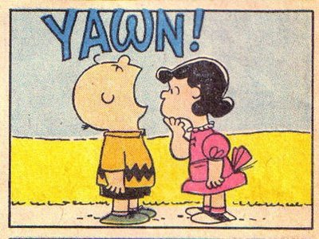

layout: true

<div class="my-footer">
<span>
<a href="http://datasciencebox.org" target="_blank">datasciencebox.org</a>
</span>
</div> 

```{r setup, include=FALSE}
# R options
options(
  htmltools.dir.version = FALSE, # for blogdown
  show.signif.stars = FALSE,     # for regression output
  warm = 1
  )
# Set dpi and height for images
knitr::opts_chunk$set(fig.height = 3, fig.width = 5, dpi = 300, 
                      warning = FALSE, 
                      message = FALSE, 
                      fig.align = "center") 
# ggplot2 color palette with gray
color_palette <- list(gray = "#999999", 
                      salmon = "#E69F00", 
                      lightblue = "#56B4E9", 
                      green = "#009E73", 
                      yellow = "#F0E442", 
                      darkblue = "#0072B2", 
                      red = "#D55E00", 
                      purple = "#CC79A7")
htmltools::tagList(rmarkdown::html_dependency_font_awesome())
# For magick
dev.off <- function(){
  invisible(grDevices::dev.off())
}
# For ggplot2
ggplot2::theme_set(ggplot2::theme_bw())
```

```{r packages, echo=FALSE, message=FALSE, warning=FALSE}
library(tidyverse)
library(broom)
library(knitr)
library(DT)
library(openintro)
library(infer)
library(patchwork)
library(kableExtra)
```

---

## Housekeeping

- HW 06 due tomorrow at 11:59pm

- We will begin project work this Wednesday, so *please* come to class

- Third job candidate is giving talk this Wednesday from 12:30-1:30pm in 75 Shannon Street Room 224
  
  - Candidate: Taylor Okonek
  
  - Talk title: "Child Mortality Estimation in a Low- and Middle-Income Country Context"


---


## Recap

We saw how to compare two sample *means* against each other.

.question[
What if we wanted to compare two sample *proportions* against each other?
]

---


class: center, middle

# Permutation tests for proportions

---

## Is yawning contagious?

.pull-left[

]
.pull-right[

]

---

## Is yawning contagious?

An experiment conducted by the MythBusters tested if a person can be subconsciously influenced into yawning if another person near them yawns.

They recruited 50 people, spoke to each subject one-one-one, and intentially either yawned
or did not yawn during the session. Each subject sat in a small room for a fixed amount of time, and the Mythbusters secretly observed to see whether they yawned.

---

## Description

Randomly assigned people to two groups: 34 to a group where a person near them yawned (treatment) and 16 to a control group where they didn't see someone yawn (control).

```{r echo = F}
group <- c(rep("control", 16), rep("treatment", 34))
outcome <- c(rep("no yawn", 12), rep("yawn", 4), rep("no yawn", 24), rep("yawn", 10))
mb_yawn <- data.frame(group = group, outcome = outcome) %>%
  sample_n(size = 50)
```

```{r}
glimpse(mb_yawn)
mb_yawn %>%
  count(group, outcome)
```

---

## Proportion of yawners

```{r}
mb_yawn %>%
  count(group, outcome) %>%
  group_by(group) %>%
  mutate(rel_prop = round(n / sum(n), 2))
```

The Mythbusters claimed that the difference in proportion of yawners between the two groups (0.04) was significant, based on intuition. Let's see if hypothesis testing agrees...

---

## Independence? 

Based on the proportions we calculated, do you think yawning is really contagious, i.e. are seeing someone yawn and yawning dependent?

```{r echo = F}
mb_yawn %>%
  count(group, outcome) %>%
  group_by(group) %>%
  mutate(p_hat = round(n / sum(n), 2))
```

---

## Possible explanations

- The observed differences might suggest that yawning is contagious, i.e. seeing someone yawn and yawning are dependent

- But the differences are small enough that we might wonder if they might simple be **due to chance**

- If we were to repeat the experiment on another group of 50 people, we may see different results. So let's simulate using a **permutation test**

---

## Hypotheses

- $H_0$: yawning (outcome) and seeing someone yawn (treatment vs. control) are independent:

$$p_{treat} = p_{control}$$

- $H_{a}$: yawning and seeing someone yawn are not independent (in fact, we will specify that the proportion of yawners is greater in the treatment group than in the control group:

$$p_{treat} > p_{control}$$

where $p_{treat}$ is the true proportion of yawners among those who saw someone else yawn, and similarly for 
$p_{control}$.

--

- Note, these are equivalent to $H_0: p_{treat} - p_{control} = 0$ and $H_a: p_{treat} - p_{control} > 0$.

---

## Observed data

From our observed data, we see that 4/16 of the control people yawned, whereas 10/34 of the treatment group yawned

```{r echo = F}
table(group = mb_yawn$group, outcome = mb_yawn$outcome)
```


---

## Observed test statistic 

The *observed* difference in proportion of yawners is 0.0441.

```{r}
## OPTION 1
prop_yawn_treat <- mb_yawn %>%
  filter(group == "treatment") %>%
  summarise(prop = mean(outcome == "yawn")) %>%
  pull()
prop_yawn_control <- mb_yawn %>%
  filter(group == "control") %>%
  summarise(prop = mean(outcome == "yawn")) %>%
  pull()
p_hat_diff  <- prop_yawn_treat - prop_yawn_control
p_hat_diff
```

---

## Observed test statistic 

The *observed* difference in proportion of yawners is 0.0441.

```{r}
## OPTION 2
p_hat_diff <- mb_yawn  %>%
  specify(outcome ~ group, success = "yawn") %>%
  calculate(stat = "diff in props", order = c("treatment", "control")) %>%
  pull()

p_hat_diff
```

--

.question[How to simulate a null distribution?]

---

## The null hypothesis

- Recall that under $H_0$, there is no association between seeing someone yawn (treatment vs control) and the act of yawning (outcome). This means that:

  - Those 14 people who yawned were going to yawn *no matter which group they were assigned to*
  
  - Those 36 people who did not yawn were not going to yawn *no matter which group they were assigned to*

---


##  Permuting the treatment assignments

- While keeping the responses (yawn vs. no yawn) fixed at what we observed, we will *permute* or shuffle the treatment assignments of the observations and recalculate the difference in proportions.


- This recalculates the difference in proportions as if some of the yawners and some of the non-yawners perhaps might have been in a different treatment group.

--

.question[Why do we do this?]

--

- If there truly is no association between treatment and control, then shuffling whether someone was assigned to watch somebody yawn or not yawn shouldn't matter -- we would expect similar proportions of people who yawn in each group.


---

## Repeated permutations

- We will do this treatment-shuffling again and again, calculate the difference in proportions for each simulation, and use this as an approximation to the null distribution.

- This distribution approximates all the possible differences in proportion we could have seen if 
$H_0$ were in fact true. 


---

## Simulate!

```{r echo = F}
table(group = mb_yawn$group, outcome = mb_yawn$outcome)
```

- Take 14 red cards, let these be those who did "yawn"

- Take 36 black cards, let these be those who did "not yawn"

--

- Shuffle these cards

--

- Deal 16 at random into the simulated "control" group, and the remaining 34 into the simulated "treatment" group

- Calculate the proportion of yawners in each group, and take the difference (treatment - control)

---

## Using `infer`

```{r eval = F}
null_dist <- mb_yawn %>%
  specify(outcome ~ group, success = "yawn") %>%  #<<
  hypothesize(null = "independence") %>%
  generate(1000, type = "permute") %>%
  calculate(stat = "diff in props", order = c("treatment", "control"))
```

- Because we are interested in the whether or not someone yawned within each group, we `specify(outcome ~ group)`, not the other way around 

- Since the response variable is categorical (i.e. we are interested in a proportion), need to `specify` which level of the response `outcome` should be considered a success

---

## Using `infer`

```{r eval = F}
null_dist <- mb_yawn %>%
  specify(response = outcome, explanatory = group, success = "yawn") %>%  
  hypothesize(null = "independence") %>% #<<
  generate(1000, type = "permute") %>% 
  calculate(stat = "diff in props", order = c("treatment", "control"))
```

Null hypothesis: the outcome and treatment are independent.

---


## Using `infer`

```{r eval = F}
null_dist <- mb_yawn %>%
  specify(response = outcome, explanatory = group, success = "yawn") %>%  
  hypothesize(null = "independence") %>% 
  generate(1000, type = "permute") %>% #<<
  calculate(stat = "diff in props", order = c("treatment", "control"))
```

Generate simulated results via permutation

---

## Using `infer`

```{r}
set.seed(100)
null_dist <- mb_yawn %>%
  specify(response = outcome, explanatory = group, success = "yawn") %>%  
  hypothesize(null = "independence") %>% 
  generate(1000, type = "permute") %>% 
  calculate(stat = "diff in props", order = c("treatment", "control"))#<<
```

- Calculate the sample statistic of interest (difference in proportions). 

- Because the explanatory variable `group` is categorical, we need to tell R the
order in which to take the different in proportions for the calculation: $(\hat{p}_{treat} - \hat{p}_{control})$.

---

## Visualizing the null distribution

What would you expect the center of the null distribution to be?


```{r fig.height=2}
visualize(null_dist) 
```

---

## Calculating the p-value

```{r}
null_dist %>%
  filter(stat >= p_hat_diff) %>%
  summarise(p_val = n()/nrow(null_dist))
```


.question[What is the conclusion of our hypothesis test?]

