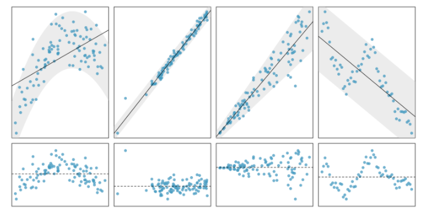

layout: true

```{r setup, include=FALSE}
# R options
options(
  htmltools.dir.version = FALSE, # for blogdown
  show.signif.stars = FALSE,     # for regression output
  warm = 1
  )
# Set dpi and height for images
knitr::opts_chunk$set(fig.height = 3, fig.width = 5, dpi = 300, 
                      warning = FALSE, 
                      message = FALSE, 
                      fig.align = "center") 
# ggplot2 color palette with gray
color_palette <- list(gray = "#999999", 
                      salmon = "#E69F00", 
                      lightblue = "#56B4E9", 
                      green = "#009E73", 
                      yellow = "#F0E442", 
                      darkblue = "#0072B2", 
                      red = "#D55E00", 
                      purple = "#CC79A7")
htmltools::tagList(rmarkdown::html_dependency_font_awesome())
# For magick
dev.off <- function(){
  invisible(grDevices::dev.off())
}
# For ggplot2
ggplot2::theme_set(ggplot2::theme_bw())
```

```{r packages, echo=FALSE, message=FALSE, warning=FALSE}
library(tidyverse)
library(broom)
library(knitr)
library(DT)
library(openintro)
library(infer)
library(patchwork)
library(kableExtra)
data("faithful")
data("ames")
```

---

## Data: Old Faithful

- We have data about the Old Faithful geyser in Yellowstone National Park

  - `eruptions`: Eruption time (in mins)
  - `waiting`: Waiting time to next eruption (in mins)

```{r}
faithful %>%
  slice(1:3)
```

---

## EDA

.question[How would you describe the relationship between eruption time and waiting time for Old Faithful?]

```{r echo = F, fig.height=3, fig.width=8}
ggplot(faithful, aes(x = eruptions, y = waiting))+
  geom_point() +
  labs(x = "Eruption time (min)", y = "Waiting time (min)")+
  theme(text = element_text(size = 20))
```

---

## Linear regression model

```{r}
mod_faithful <- lm(waiting ~ eruptions, data = faithful)
tidy(mod_faithful)
```

.question[How would you interrupt the intercept and slope?]

---

## Tidy regression output

Achieved with functions from the `broom` package:

- .vocab[`tidy`]: Constructs a data frame that summarizes the model's statistical findings. We've talked about coefficient estimates and standard errors, but it also displays *test statistics and p-values*

- .vocab[`augment`]: Adds columns to the original data that was modeled. This includes predictions and residuals.

- .vocab[`glance`]: Constructs a concise one-row summary of the model, computed once for the entire model. 

---

## Tidy your model's statistical findings


```{r}
tidy(mod_faithful) %>%
  select(term, estimate) %>%
  mutate(estimate = round(estimate, 3))
```
 
---

class: center, middle

## Model diagnostics

---

## Conditions

- **Linearity**: The relationship between response and predictor(s) is linear

- Independence: The residuals are independent

- **Normality**: The residuals are nearly normally distributed

- Equal Variance: The residuals have constant variance


.alert[We will just focus on linearity and normality in this class.]

---

## Conditions

- .vocab[L]**inearity**: The relationship between response and predictor(s) is linear

- .vocab[I]ndependence: The residuals are independent

- .vocab[N]**ormality**: The residuals are nearly normally distributed

- .vocab[E]qual Variance: The residuals have constant variance


---

## Examples 

```{r, echo=FALSE, out.width = "50%", fig.align="center"}

```

Top row: scatterplot of $x$ vs $y$

Bottom row: residual plot 

---

## `augment` data with model results

- `.fitted`: Predicted value of the response variable $(\hat{y})$
- `.resid`: Residuals $(y - \hat{y})$

.midi[
```{r}
mod_faithful_aug <- augment(mod_faithful) #<<
mod_faithful_aug %>%
  slice(1:3)
```
]

--

We will use the fitted values (`.fitted`) and residuals (`.resid`) to check the conditions by 
constructing .vocab[diagnostic plots].

---

### Residuals vs fitted plot

Use to check .vocab[**L**inearity] and .vocab[**E**qual variance.]

.midi[
```{r, fig.height = 1.75}
ggplot(mod_faithful_aug, mapping = aes(x = .fitted, y = .resid)) +
  geom_point() + geom_hline(yintercept = 0, lwd = 2, col = "red", lty = 2) +
  labs(x = "Predicted waiting time (min.)", y = "Residuals") 
```
]

---

### Residuals vs fitted plot

.alert[
This is a good example! We don't see any patterns in the residuals.
]

.midi[
```{r echo = F, fig.height = 1.75}
ggplot(mod_faithful_aug, mapping = aes(x = .fitted, y = .resid)) +
  geom_point() + geom_hline(yintercept = 0, lwd = 2, col = "red", lty = 2) +
  labs(x = "Predicted waiting time (min.)", y = "Residuals") 
```
]


---

### Histogram of residuals

Use to check .vocab[**N**ormality]

.midi[
```{r fig.height= 1.75}
ggplot(mod_faithful_aug, mapping = aes(x = .resid)) +
  geom_histogram(bins = 15) + labs(x = "Residuals")
```
]

---

### Histogram of residuals

.alert[
This is a good example! We want to see symmetric, bell-shaped curve here.
]

```{r echo = F, fig.height= 2}
ggplot(mod_faithful_aug, mapping = aes(x = .resid)) +
  geom_histogram(bins = 15) + labs(x = "Residuals")
```

---

class: center, middle

## Assessing quality of model fit

---

## Assessing the quality of the fit

- The strength of the fit of a linear model is commonly evaluated using $R^2$, sometimes called the .vocab[coefficient of determination]

- It tells us what percentage of the variability in the response variable is explained by the model. The remainder of the variability is unexplained.

  - The $R^2$ is always between 0 and 100 (or 0 and 1)
  
--


.question[
What does "explained variability in the response variable" mean?
]

--

.question[What does an $R^2 = 1$ tell us? What about an $R^2 = 0$?]

---

## Obtaining $R^2$ in R

The $R^2$ of our model is:

```{r}
glance(mod_faithful)
glance(mod_faithful) %>%
  pull(r.squared)
```

--

- Interpretation: about 81.1% of the variability in Old Faithful's `waiting` times  can be explained by the previous `eruption` time.


---

class: center, middle


## Your turn! 

---

### Ames housing prices

- This data set contains information about homes sold in Ames, Iowa from 2006 to 2010

- We will focus today on two variables:

  - `price`: sale price in USD
  
  - `area`: Above grade (ground) living area square feet
  


