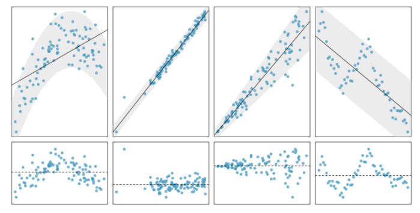

layout: true

<div class="my-footer">
<span>
<a href="http://datasciencebox.org" target="_blank">datasciencebox.org</a>
</span>
</div> 


```{r setup, include=FALSE}
# R options
options(
  htmltools.dir.version = FALSE, # for blogdown
  show.signif.stars = FALSE,     # for regression output
  warm = 1
  )
# Set dpi and height for images
knitr::opts_chunk$set(fig.height = 3, fig.width = 5, dpi = 300, 
                      warning = FALSE, 
                      message = FALSE, 
                      fig.align = "center") 
# ggplot2 color palette with gray
color_palette <- list(gray = "#999999", 
                      salmon = "#E69F00", 
                      lightblue = "#56B4E9", 
                      green = "#009E73", 
                      yellow = "#F0E442", 
                      darkblue = "#0072B2", 
                      red = "#D55E00", 
                      purple = "#CC79A7")
htmltools::tagList(rmarkdown::html_dependency_font_awesome())
# For magick
dev.off <- function(){
  invisible(grDevices::dev.off())
}
# For ggplot2
ggplot2::theme_set(ggplot2::theme_bw())
```

```{r packages, echo=FALSE, message=FALSE, warning=FALSE}
library(tidyverse)
library(broom)
library(knitr)
library(DT)
library(openintro)
library(infer)
library(patchwork)
library(kableExtra)
sports_car_prices <- read_csv("data/sports_cars.csv") %>%
  rename("type" = "car")
```

---

class: center, middle

## Review

---


## Vocabulary

- .vocab[Response variable]: Variable whose behavior or variation you are trying 
to understand. 

- .vocab[Explanatory variables]: Other variables that you want to use to explain
the variation in the response. 

- .vocab[Predicted value]: Output of the **model function**

- .vocab[Residuals]: Shows how far each case is from its predicted value
   - **Residual = Observed value - Predicted value**

---


## The linear model with multiple predictors

- Population model:

$$\hat{y} = \beta_0 + \beta_1~x_1 + \beta_2~x_2 + \cdots + \beta_p~x_p$$

--

- Sample model that we use to estimate the population model:
  
$$\hat{y} = b_0 + b_1~x_1 + b_2~x_2 + \cdots + b_p~x_p$$

---

class: center, middle

## Conditions for Inference in Regression

---

## Conditions

- **Linearity**: The relationship between response and predictor(s) is linear

- **Independence**: The residuals are independent

- **Normality**: The residuals are nearly normally distributed

- **Equal Variance**: The residuals have constant variance


---

## Conditions

- .vocab[L]**inearity**: The relationship between response and predictor(s) is linear

- .vocab[I]**ndependence**: The residuals are independent

- .vocab[N]**ormality**: The residuals are nearly normally distributed

- .vocab[E]**qual Variance**: The residuals have constant variance

--

<br> 

*For multiple regression, the predictors shouldn't be too correlated with each 
other.*


---

## Examples 

```{r, echo=FALSE, out.width = "50%", fig.align="center"}

```

Top row: scatterplot of $x$ vs $y$

Bottom row: residual plot 

---

## `augment` data with model results

- `.fitted`: Predicted value of the response variable
- `.resid`: Residuals

.midi[
```{r}
mod <- lm(price ~ mileage + age, data = sports_car_prices)
mod_aug <- augment(mod) #<<
mod_aug %>%
  slice(1:3)
```
]

--

We will use the fitted values (`.fitted`) and residuals (`.resid`) to check the conditions by 
constructing .vocab[diagnostic plots].

---

### Residuals vs fitted plot

Use to check .vocab[**L**inearity] and .vocab[**E**qual variance.]

.midi[
```{r, fig.height = 1.75}
ggplot(mod_aug, mapping = aes(x = .fitted, y = .resid)) +
  geom_point() + geom_hline(yintercept = 0, lwd = 2, col = "red", lty = 2) +
  labs(x = "Predicted Mileage", y = "Residuals") 
```
]

---

### Residuals in order of collection

Use to check .vocab[**I**ndependence]

.midi[
```{r, fig.height = 1.5}
ggplot(data = mod_aug, 
       aes(x = 1:nrow(sports_car_prices), 
           y = .resid)) + 
  geom_point() + geom_hline(yintercept = 0, lwd = 2, col = "red", lty = 2) +
  labs(x = "Index", y = "Residual")
```
]

---

### Histogram of residuals

Use to check .vocab[**N**ormality]

.midi[
```{r fig.height= 1.75}
ggplot(mod_aug, mapping = aes(x = .resid)) +
  geom_histogram(bins = 15) + labs(x = "Residuals")
```
]

---

## Collinearity

- Because we are performing multiple linear regression, we should check if the numerical predictors are extremely correlated with each other

```{r}
sports_car_prices %>% 
  select(mileage, age) %>%
  cor()
```
